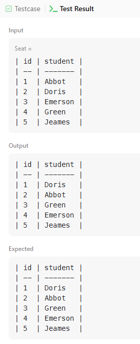
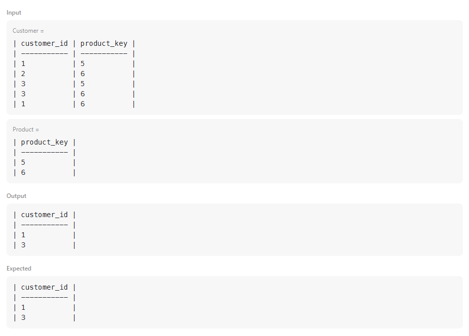
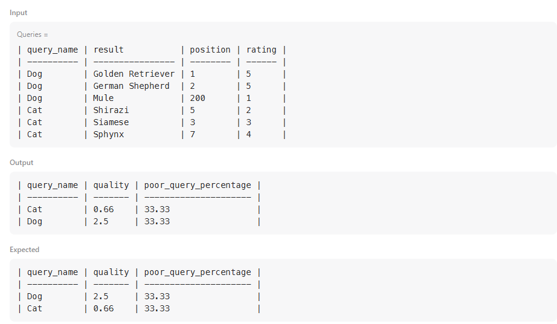

# 626. Exchange Seats

Table: Seat
```
+-------------+---------+
| Column Name | Type    |
+-------------+---------+
| id          | int     |
| student     | varchar |
+-------------+---------+
id is the primary key (unique value) column for this table.
Each row of this table indicates the name and the ID of a student.
The ID sequence always starts from 1 and increments continuously.
```
 

Write a solution to swap the seat id of every two consecutive students. If the number of students is odd, the id of the last student is not swapped.

Return the result table ordered by id in ascending order.

The result format is in the following example.

 

### Example 1:
```
Input: 
Seat table:
+----+---------+
| id | student |
+----+---------+
| 1  | Abbot   |
| 2  | Doris   |
| 3  | Emerson |
| 4  | Green   |
| 5  | Jeames  |
+----+---------+
Output: 
+----+---------+
| id | student |
+----+---------+
| 1  | Doris   |
| 2  | Abbot   |
| 3  | Green   |
| 4  | Emerson |
| 5  | Jeames  |
+----+---------+
```
Explanation: 
Note that if the number of students is odd, there is no need to change the last one's seat.

``` sql
SELECT 
    CASE 
        WHEN id % 2 = 1 AND id = (SELECT MAX(id) FROM Seat) THEN id
        WHEN id % 2 = 1 THEN id + 1
        ELSE id - 1
    END AS id,
    student
FROM 
    Seat
ORDER BY 
    id ASC;
```


# 1045. Customers Who Bought All Products

Table: Customer
```
+-------------+---------+
| Column Name | Type    |
+-------------+---------+
| customer_id | int     |
| product_key | int     |
+-------------+---------+
This table may contain duplicates rows. 
customer_id is not NULL.
product_key is a foreign key (reference column) to Product table.
```

Table: Product
```
+-------------+---------+
| Column Name | Type    |
+-------------+---------+
| product_key | int     |
+-------------+---------+
product_key is the primary key (column with unique values) for this table.
```

Write a solution to report the customer ids from the Customer table that bought all the products in the Product table.

Return the result table in any order.

The result format is in the following example.

 

### Example 1:
```
Input: 
Customer table:
+-------------+-------------+
| customer_id | product_key |
+-------------+-------------+
| 1           | 5           |
| 2           | 6           |
| 3           | 5           |
| 3           | 6           |
| 1           | 6           |
+-------------+-------------+
Product table:
+-------------+
| product_key |
+-------------+
| 5           |
| 6           |
+-------------+
Output: 
+-------------+
| customer_id |
+-------------+
| 1           |
| 3           |
+-------------+
```
Explanation: 
The customers who bought all the products (5 and 6) are customers with IDs 1 and 3.

```sql
SELECT customer_id
FROM Customer GROUP BY customer_id
HAVING COUNT(DISTINCT product_key) = (SELECT COUNT(*) FROM Product)
```



# 1211. Queries Quality and Percentage

Table: Queries
```
+-------------+---------+
| Column Name | Type    |
+-------------+---------+
| query_name  | varchar |
| result      | varchar |
| position    | int     |
| rating      | int     |
+-------------+---------+
This table may have duplicate rows.
This table contains information collected from some queries on a database.
The position column has a value from 1 to 500.
The rating column has a value from 1 to 5. Query with rating less than 3 is a poor query.
```

We define query quality as:
```
The average of the ratio between query rating and its position.
```
We also define poor query percentage as:
```
The percentage of all queries with rating less than 3.
```
Write a solution to find each query_name, the quality and poor_query_percentage.

Both quality and poor_query_percentage should be rounded to 2 decimal places.

Return the result table in any order.

The result format is in the following example.

### Example 1:
```
Input: 
Queries table:
+------------+-------------------+----------+--------+
| query_name | result            | position | rating |
+------------+-------------------+----------+--------+
| Dog        | Golden Retriever  | 1        | 5      |
| Dog        | German Shepherd   | 2        | 5      |
| Dog        | Mule              | 200      | 1      |
| Cat        | Shirazi           | 5        | 2      |
| Cat        | Siamese           | 3        | 3      |
| Cat        | Sphynx            | 7        | 4      |
+------------+-------------------+----------+--------+
Output: 
+------------+---------+-----------------------+
| query_name | quality | poor_query_percentage |
+------------+---------+-----------------------+
| Dog        | 2.50    | 33.33                 |
| Cat        | 0.66    | 33.33                 |
+------------+---------+-----------------------+
```
Explanation: 
Dog queries quality is ((5 / 1) + (5 / 2) + (1 / 200)) / 3 = 2.50
Dog queries poor_ query_percentage is (1 / 3) * 100 = 33.33

Cat queries quality equals ((2 / 5) + (3 / 3) + (4 / 7)) / 3 = 0.66
Cat queries poor_ query_percentage is (1 / 3) * 100 = 33.33


```sql
SELECT 
    query_name,
    ROUND(AVG(rating * 1.0 / position), 2) AS quality,
    ROUND(SUM(CASE WHEN rating < 3 THEN 1 ELSE 0 END) * 100.0 / COUNT(*), 2) AS poor_query_percentage
FROM Queries
GROUP BY query_name;
```
