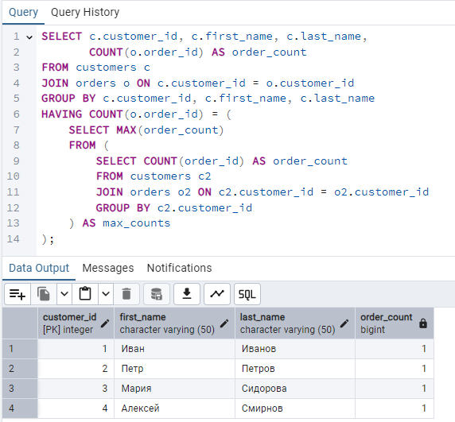
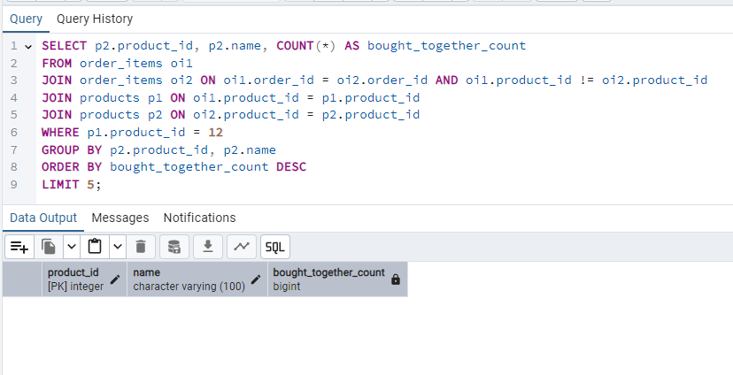
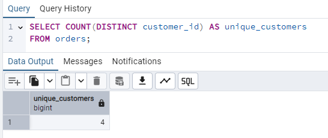
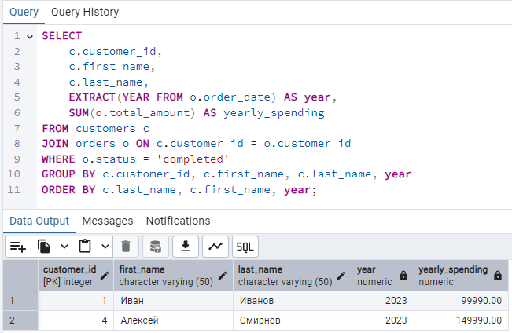

# Архитектура базы данных интернет-магазина электроники

## Создание таблиц
### Запросы по таблицами
```sql
-- 1. Создание таблицы users
CREATE TABLE users (
    user_id SERIAL PRIMARY KEY,
    username VARCHAR(50) NOT NULL UNIQUE,
    email VARCHAR(100) NOT NULL UNIQUE,
    password_hash VARCHAR(255) NOT NULL,
    created_at TIMESTAMP NOT NULL DEFAULT CURRENT_TIMESTAMP,
    last_login TIMESTAMP
);

-- 2. Создание таблицы customers
CREATE TABLE customers (
    customer_id SERIAL PRIMARY KEY,
    user_id INT NOT NULL UNIQUE,
    first_name VARCHAR(50) NOT NULL,
    last_name VARCHAR(50) NOT NULL,
    phone VARCHAR(20),
    address TEXT,
    CONSTRAINT fk_user
        FOREIGN KEY(user_id) 
        REFERENCES users(user_id)
        ON DELETE CASCADE
);

-- 3. Создание таблицы employees
CREATE TABLE employees (
    employee_id SERIAL PRIMARY KEY,
    user_id INT NOT NULL UNIQUE,
    first_name VARCHAR(50) NOT NULL,
    last_name VARCHAR(50) NOT NULL,
    position VARCHAR(100) NOT NULL,
    hire_date DATE NOT NULL,
    salary NUMERIC(10,2) NOT NULL,
    CONSTRAINT fk_user
        FOREIGN KEY(user_id) 
        REFERENCES users(user_id)
        ON DELETE CASCADE
);

-- 4. Создание таблицы categories
CREATE TABLE categories (
    category_id SERIAL PRIMARY KEY,
    name VARCHAR(100) NOT NULL,
    description TEXT,
    parent_id INT,
    CONSTRAINT fk_parent
        FOREIGN KEY(parent_id) 
        REFERENCES categories(category_id)
        ON DELETE SET NULL
);

-- 5. Создание таблицы products
CREATE TABLE products (
    product_id SERIAL PRIMARY KEY,
    category_id INT NOT NULL,
    name VARCHAR(100) NOT NULL,
    description TEXT,
    price NUMERIC(10,2) NOT NULL,
    stock_quantity INT NOT NULL DEFAULT 0,
    created_at TIMESTAMP NOT NULL DEFAULT CURRENT_TIMESTAMP,
    updated_at TIMESTAMP,
    CONSTRAINT fk_category
        FOREIGN KEY(category_id) 
        REFERENCES categories(category_id)
        ON DELETE RESTRICT
);

-- 6. Создание таблицы product_images
CREATE TABLE product_images (
    image_id SERIAL PRIMARY KEY,
    product_id INT NOT NULL,
    image_url VARCHAR(255) NOT NULL,
    is_primary BOOLEAN NOT NULL DEFAULT FALSE,
    CONSTRAINT fk_product
        FOREIGN KEY(product_id) 
        REFERENCES products(product_id)
        ON DELETE CASCADE
);

-- 7. Создание таблицы product_specifications
CREATE TABLE product_specifications (
    spec_id SERIAL PRIMARY KEY,
    product_id INT NOT NULL,
    spec_name VARCHAR(100) NOT NULL,
    spec_value TEXT NOT NULL,
    CONSTRAINT fk_product
        FOREIGN KEY(product_id) 
        REFERENCES products(product_id)
        ON DELETE CASCADE
);

-- 8. Создание таблицы orders
CREATE TABLE orders (
    order_id SERIAL PRIMARY KEY,
    customer_id INT NOT NULL,
    order_date TIMESTAMP NOT NULL DEFAULT CURRENT_TIMESTAMP,
    status VARCHAR(20) NOT NULL CHECK (status IN ('new', 'processing', 'completed', 'cancelled')),
    total_amount NUMERIC(10,2) NOT NULL,
    shipping_address TEXT NOT NULL,
    CONSTRAINT fk_customer
        FOREIGN KEY(customer_id) 
        REFERENCES customers(customer_id)
        ON DELETE RESTRICT
);

-- 9. Создание таблицы order_items
CREATE TABLE order_items (
    order_item_id SERIAL PRIMARY KEY,
    order_id INT NOT NULL,
    product_id INT NOT NULL,
    quantity INT NOT NULL CHECK (quantity > 0),
    unit_price NUMERIC(10,2) NOT NULL,
    subtotal NUMERIC(10,2) NOT NULL,
    CONSTRAINT fk_order
        FOREIGN KEY(order_id) 
        REFERENCES orders(order_id)
        ON DELETE CASCADE,
    CONSTRAINT fk_product
        FOREIGN KEY(product_id) 
        REFERENCES products(product_id)
        ON DELETE RESTRICT
);

-- 10. Создание таблицы payments
CREATE TABLE payments (
    payment_id SERIAL PRIMARY KEY,
    order_id INT NOT NULL,
    amount NUMERIC(10,2) NOT NULL,
    payment_method VARCHAR(50) NOT NULL,
    payment_date TIMESTAMP NOT NULL DEFAULT CURRENT_TIMESTAMP,
    status VARCHAR(20) NOT NULL CHECK (status IN ('pending', 'completed', 'failed', 'refunded')),
    CONSTRAINT fk_order
        FOREIGN KEY(order_id) 
        REFERENCES orders(order_id)
        ON DELETE RESTRICT
);

-- 11. Создание таблицы shipping
CREATE TABLE shipping (
    shipping_id SERIAL PRIMARY KEY,
    order_id INT NOT NULL UNIQUE,
    shipping_method VARCHAR(50) NOT NULL,
    tracking_number VARCHAR(100),
    shipping_date TIMESTAMP,
    estimated_delivery DATE,
    status VARCHAR(20) NOT NULL CHECK (status IN ('pending', 'in_transit', 'delivered', 'failed')),
    CONSTRAINT fk_order
        FOREIGN KEY(order_id) 
        REFERENCES orders(order_id)
        ON DELETE CASCADE
);

-- 12. Создание таблицы reviews
CREATE TABLE reviews (
    review_id SERIAL PRIMARY KEY,
    product_id INT NOT NULL,
    customer_id INT NOT NULL,
    rating INT NOT NULL CHECK (rating BETWEEN 1 AND 5),
    comment TEXT,
    review_date TIMESTAMP NOT NULL DEFAULT CURRENT_TIMESTAMP,
    CONSTRAINT fk_product
        FOREIGN KEY(product_id) 
        REFERENCES products(product_id)
        ON DELETE CASCADE,
    CONSTRAINT fk_customer
        FOREIGN KEY(customer_id) 
        REFERENCES customers(customer_id)
        ON DELETE CASCADE
);

-- 13. Создание таблицы discounts
CREATE TABLE discounts (
    discount_id SERIAL PRIMARY KEY,
    product_id INT NOT NULL,
    discount_percent NUMERIC(5,2) NOT NULL CHECK (discount_percent > 0 AND discount_percent < 100),
    start_date DATE NOT NULL,
    end_date DATE NOT NULL,
    is_active BOOLEAN NOT NULL DEFAULT TRUE,
    CONSTRAINT fk_product
        FOREIGN KEY(product_id) 
        REFERENCES products(product_id)
        ON DELETE CASCADE,
    CONSTRAINT check_dates CHECK (start_date <= end_date)
);

-- 14. Создание таблицы promotions
CREATE TABLE promotions (
    promotion_id SERIAL PRIMARY KEY,
    name VARCHAR(100) NOT NULL,
    description TEXT,
    start_date DATE NOT NULL,
    end_date DATE NOT NULL,
    discount_percent NUMERIC(5,2) NOT NULL CHECK (discount_percent > 0 AND discount_percent < 100),
    CONSTRAINT check_promo_dates CHECK (start_date <= end_date)
);

-- 15. Создание таблицы promotion_products
CREATE TABLE promotion_products (
    promotion_product_id SERIAL PRIMARY KEY,
    promotion_id INT NOT NULL,
    product_id INT NOT NULL,
    CONSTRAINT fk_promotion
        FOREIGN KEY(promotion_id) 
        REFERENCES promotions(promotion_id)
        ON DELETE CASCADE,
    CONSTRAINT fk_product
        FOREIGN KEY(product_id) 
        REFERENCES products(product_id)
        ON DELETE CASCADE,
    CONSTRAINT unique_promotion_product UNIQUE (promotion_id, product_id)
);
```
### Заполнение таблиц
```sql
-- 1. Добавляем пользователей
INSERT INTO users (username, email, password_hash, created_at, last_login) VALUES
('ivanov', 'ivanov@example.com', 'hashed_password_1', '2023-01-15 10:00:00', '2023-06-20 14:30:00'),
('petrov', 'petrov@example.com', 'hashed_password_2', '2023-02-10 11:30:00', '2023-06-21 09:15:00'),
('sidorova', 'sidorova@example.com', 'hashed_password_3', '2023-03-05 09:20:00', '2023-06-19 16:45:00'),
('smirnov', 'smirnov@example.com', 'hashed_password_4', '2023-04-20 14:10:00', '2023-06-22 10:30:00'),
('admin1', 'admin@shop.com', 'hashed_admin_password', '2023-01-01 08:00:00', '2023-06-22 08:00:00');

-- 2. Добавляем клиентов
INSERT INTO customers (user_id, first_name, last_name, phone, address) VALUES
(1, 'Иван', 'Иванов', '+79161234567', 'г. Москва, ул. Ленина, д. 10, кв. 25'),
(2, 'Петр', 'Петров', '+79162345678', 'г. Санкт-Петербург, Невский пр., д. 30'),
(3, 'Мария', 'Сидорова', '+79163456789', 'г. Екатеринбург, ул. Малышева, д. 45, кв. 12'),
(4, 'Алексей', 'Смирнов', '+79164567890', 'г. Новосибирск, ул. Кирова, д. 15');

-- 3. Добавляем сотрудников
INSERT INTO employees (user_id, first_name, last_name, position, hire_date, salary) VALUES
(5, 'Андрей', 'Кузнецов', 'Администратор', '2023-01-01', 80000.00);

-- 4. Добавляем категории товаров
INSERT INTO categories (name, description, parent_id) VALUES
('Электроника', 'Все виды электронных устройств', NULL),
('Бытовая техника', 'Техника для дома', NULL),
('Смартфоны', 'Мобильные телефоны с сенсорным экраном', 1),
('Ноутбуки', 'Портативные компьютеры', 1),
('Холодильники', 'Бытовая техника для охлаждения продуктов', 2);

-- 5. Добавляем товары
INSERT INTO products (category_id, name, description, price, stock_quantity, created_at, updated_at) VALUES
(3, 'iPhone 14 Pro', 'Смартфон Apple с процессором A16 Bionic, 6.1" OLED экран, 128 ГБ', 99990.00, 15, '2023-05-10 12:00:00', '2023-06-01 10:00:00'),
(3, 'Samsung Galaxy S23', 'Смартфон Samsung с процессором Snapdragon 8 Gen 2, 6.1" AMOLED, 256 ГБ', 89990.00, 20, '2023-05-15 14:30:00', '2023-06-05 11:30:00'),
(4, 'MacBook Pro 14" M2', 'Ноутбук Apple с чипом M2 Pro, 16 ГБ RAM, 512 ГБ SSD', 149990.00, 8, '2023-04-20 10:15:00', '2023-05-30 09:45:00'),
(4, 'ASUS ROG Zephyrus G14', 'Игровой ноутбук с Ryzen 9 7940HS, RTX 4060, 16 ГБ RAM, 1 ТБ SSD', 129990.00, 12, '2023-06-01 16:20:00', '2023-06-10 14:10:00'),
(5, 'LG DoorCooling+', 'Холодильник с системой DoorCooling+, 360 л, No Frost', 89990.00, 5, '2023-03-15 11:30:00', '2023-05-20 10:20:00');

-- 6. Добавляем изображения товаров
INSERT INTO product_images (product_id, image_url, is_primary) VALUES
(1, 'https://example.com/images/iphone14pro_1.jpg', TRUE),
(1, 'https://example.com/images/iphone14pro_2.jpg', FALSE),
(2, 'https://example.com/images/samsungs23_1.jpg', TRUE),
(2, 'https://example.com/images/samsungs23_2.jpg', FALSE),
(3, 'https://example.com/images/macbookpro_1.jpg', TRUE),
(4, 'https://example.com/images/asusrog_1.jpg', TRUE),
(5, 'https://example.com/images/lg_fridge_1.jpg', TRUE);

-- 7. Добавляем характеристики товаров
INSERT INTO product_specifications (product_id, spec_name, spec_value) VALUES
(1, 'Процессор', 'A16 Bionic'),
(1, 'Экран', '6.1" OLED, 2556x1179'),
(1, 'Память', '128 ГБ'),
(1, 'Камеры', 'Основная: 48 МП, фронтальная: 12 МП'),
(2, 'Процессор', 'Snapdragon 8 Gen 2'),
(2, 'Экран', '6.1" Dynamic AMOLED 2X, 2340x1080'),
(2, 'Память', '256 ГБ'),
(3, 'Процессор', 'Apple M2 Pro'),
(3, 'Экран', '14.2" Liquid Retina XDR, 3024x1964'),
(3, 'Оперативная память', '16 ГБ'),
(3, 'Накопитель', '512 ГБ SSD'),
(4, 'Процессор', 'AMD Ryzen 9 7940HS'),
(4, 'Видеокарта', 'NVIDIA GeForce RTX 4060'),
(4, 'Экран', '14" IPS, 2560x1600, 165 Гц'),
(5, 'Тип', 'Двухкамерный'),
(5, 'Общий объем', '360 л'),
(5, 'No Frost', 'Да'),
(5, 'Энергопотребление', 'A++');

-- 8. Добавляем заказы
INSERT INTO orders (customer_id, order_date, status, total_amount, shipping_address) VALUES
(1, '2023-06-05 14:25:00', 'completed', 99990.00, 'г. Москва, ул. Ленина, д. 10, кв. 25'),
(2, '2023-06-10 11:30:00', 'processing', 239980.00, 'г. Санкт-Петербург, Невский пр., д. 30'),
(3, '2023-06-15 16:45:00', 'new', 89990.00, 'г. Екатеринбург, ул. Малышева, д. 45, кв. 12'),
(4, '2023-06-18 09:15:00', 'completed', 149990.00, 'г. Новосибирск, ул. Кирова, д. 15');

-- 9. Добавляем позиции заказов
INSERT INTO order_items (order_id, product_id, quantity, unit_price, subtotal) VALUES
(1, 1, 1, 99990.00, 99990.00),
(2, 2, 1, 89990.00, 89990.00),
(2, 4, 1, 129990.00, 129990.00),
(3, 2, 1, 89990.00, 89990.00),
(4, 3, 1, 149990.00, 149990.00);

-- 10. Добавляем платежи
INSERT INTO payments (order_id, amount, payment_method, payment_date, status) VALUES
(1, 99990.00, 'credit_card', '2023-06-05 14:30:00', 'completed'),
(2, 239980.00, 'online_banking', '2023-06-10 11:35:00', 'completed'),
(4, 149990.00, 'credit_card', '2023-06-18 09:20:00', 'completed');

-- 11. Добавляем информацию о доставке
INSERT INTO shipping (order_id, shipping_method, tracking_number, shipping_date, estimated_delivery, status) VALUES
(1, 'express', 'EX123456789RU', '2023-06-06 10:00:00', '2023-06-08', 'delivered'),
(2, 'standard', 'ST987654321RU', '2023-06-11 14:30:00', '2023-06-15', 'in_transit'),
(4, 'express', 'EX456789123RU', '2023-06-18 12:00:00', '2023-06-20', 'pending');

-- 12. Добавляем отзывы
INSERT INTO reviews (product_id, customer_id, rating, comment, review_date) VALUES
(1, 1, 5, 'Отличный телефон, быстрый и удобный. Камера просто супер!', '2023-06-12 18:30:00'),
(2, 3, 4, 'Хороший телефон, но быстро садится батарея при активном использовании', '2023-06-17 15:45:00'),
(3, 4, 5, 'Лучший ноутбук, который у меня был. Работает бесшумно и очень быстро', '2023-06-20 12:15:00');

-- 13. Добавляем скидки
INSERT INTO discounts (product_id, discount_percent, start_date, end_date, is_active) VALUES
(2, 10.00, '2023-06-01', '2023-06-30', TRUE),
(4, 15.00, '2023-06-15', '2023-07-15', TRUE);

-- 14. Добавляем акции
INSERT INTO promotions (name, description, start_date, end_date, discount_percent) VALUES
('Летние скидки', 'Специальные предложения на летний сезон', '2023-06-01', '2023-08-31', 10.00),
('Выпускникам', 'Скидки для выпускников школ и вузов', '2023-06-15', '2023-07-15', 15.00);

-- 15. Добавляем товары в акции
INSERT INTO promotion_products (promotion_id, product_id) VALUES
(1, 2),
(1, 4),
(2, 3),
(2, 5);
```

### Дополнительные индексы
```sql
-- Индексы для таблицы users
CREATE INDEX idx_users_username ON users(username);
CREATE INDEX idx_users_email ON users(email);

-- Индексы для таблицы products
CREATE INDEX idx_products_category ON products(category_id);
CREATE INDEX idx_products_name ON products(name);
CREATE INDEX idx_products_price ON products(price);

-- Индексы для таблицы orders
CREATE INDEX idx_orders_customer ON orders(customer_id);
CREATE INDEX idx_orders_status ON orders(status);
CREATE INDEX idx_orders_date ON orders(order_date);

-- Индексы для таблицы order_items
CREATE INDEX idx_order_items_order ON order_items(order_id);
CREATE INDEX idx_order_items_product ON order_items(product_id);

-- Индексы для таблицы reviews
CREATE INDEX idx_reviews_product ON reviews(product_id);
CREATE INDEX idx_reviews_customer ON reviews(customer_id);
CREATE INDEX idx_reviews_rating ON reviews(rating);

-- Индексы для таблицы discounts
CREATE INDEX idx_discounts_product ON discounts(product_id);
CREATE INDEX idx_discounts_active ON discounts(is_active) WHERE is_active = TRUE;
CREATE INDEX idx_discounts_dates ON discounts(start_date, end_date);

-- Индексы для таблицы promotions
CREATE INDEX idx_promotions_dates ON promotions(start_date, end_date);

-- Индексы для таблицы promotion_products
CREATE INDEX idx_promo_products_promotion ON promotion_products(promotion_id);
CREATE INDEX idx_promo_products_product ON promotion_products(product_id);
```

## Представления
### Обычные представления
1. Активные продукты со скидкой

```sql
CREATE VIEW discounted_products AS
SELECT p.product_id, p.name, p.price, d.discount_percent, 
       p.price * (1 - d.discount_percent/100) AS discounted_price
FROM products p
JOIN discounts d ON p.product_id = d.product_id
WHERE d.is_active = TRUE AND d.end_date > CURRENT_DATE;
```


2. Заказы с деталями доставки
```sql
CREATE VIEW order_shipping_details AS
SELECT o.order_id, o.order_date, o.status, o.total_amount,
       s.shipping_method, s.tracking_number, s.shipping_date,
       s.estimated_delivery, s.status AS shipping_status
FROM orders o
JOIN shipping s ON o.order_id = s.order_id;
```


3. Рейтинги товаров
```sql
CREATE VIEW product_ratings AS
SELECT p.product_id, p.name, 
       AVG(r.rating) AS average_rating,
       COUNT(r.review_id) AS review_count
FROM products p
LEFT JOIN reviews r ON p.product_id = r.product_id
GROUP BY p.product_id, p.name;
```


### Материализованные представления

1. Ежемесячные продажи по категория
```sql
CREATE MATERIALIZED VIEW monthly_sales_by_category AS
SELECT 
    c.category_id, 
    c.name AS category_name,
    DATE_TRUNC('month', o.order_date) AS month,
    SUM(oi.quantity) AS total_quantity,
    SUM(oi.subtotal) AS total_sales
FROM orders o
JOIN order_items oi ON o.order_id = oi.order_id
JOIN products p ON oi.product_id = p.product_id
JOIN categories c ON p.category_id = c.category_id
GROUP BY c.category_id, c.name, DATE_TRUNC('month', o.order_date)
ORDER BY month, total_sales DESC;
```


2. Топ 10 продаваемых товаров
```sql
CREATE MATERIALIZED VIEW top_selling_products AS
SELECT 
    p.product_id, 
    p.name,
    SUM(oi.quantity) AS total_quantity,
    SUM(oi.subtotal) AS total_sales
FROM products p
JOIN order_items oi ON p.product_id = oi.product_id
GROUP BY p.product_id, p.name
ORDER BY total_quantity DESC
LIMIT 10;
```


## Запросы к базе данных
### 15 запросов со вложенностью

1. Товары, которые никогда не заказывали
```sql
SELECT p.product_id, p.name
FROM products p
WHERE p.product_id NOT IN (
    SELECT DISTINCT product_id FROM order_items
);
```


2. Клиенты, сделавшие заказ на сумму больше средней
```sql
SELECT c.customer_id, c.first_name, c.last_name, SUM(o.total_amount) AS total_spent
FROM customers c
JOIN orders o ON c.customer_id = o.customer_id
GROUP BY c.customer_id, c.first_name, c.last_name
HAVING SUM(o.total_amount) > (
    SELECT AVG(total_amount) FROM orders
);
```


3. Категории с количеством товаров больше среднего
```sql
SELECT c.category_id, c.name, COUNT(p.product_id) AS product_count
FROM categories c
JOIN products p ON c.category_id = p.category_id
GROUP BY c.category_id, c.name
HAVING COUNT(p.product_id) > (
    SELECT AVG(cnt) FROM (
        SELECT COUNT(product_id) AS cnt 
        FROM products 
        GROUP BY category_id
    ) AS avg_counts
);
```


4. Товары с рейтингом выше среднего в своей категории
```sql
SELECT p.product_id, p.name, r.avg_rating, c.name AS category
FROM products p
JOIN (
    SELECT product_id, AVG(rating) AS avg_rating
    FROM reviews
    GROUP BY product_id
) r ON p.product_id = r.product_id
JOIN categories c ON p.category_id = c.category_id
WHERE r.avg_rating > (
    SELECT AVG(rating) 
    FROM reviews 
    WHERE product_id IN (
        SELECT product_id 
        FROM products 
        WHERE category_id = p.category_id
    )
);
```


5. Клиенты, которые заказывали все товары из 1 категории
```sql
SELECT c.customer_id, c.first_name, c.last_name
FROM customers c
WHERE NOT EXISTS (
    SELECT p.product_id
    FROM products p
    WHERE p.category_id = 1
    AND NOT EXISTS (
        SELECT 1
        FROM order_items oi
        JOIN orders o ON oi.order_id = o.order_id
        WHERE oi.product_id = p.product_id
        AND o.customer_id = c.customer_id
    )
);
```


6. Самый популярный товар из каждой категории
```sql
SELECT c.name AS category, p.name AS product, sales.total_quantity
FROM (
    SELECT p.category_id, p.product_id, 
           SUM(oi.quantity) AS total_quantity,
           RANK() OVER (PARTITION BY p.category_id ORDER BY SUM(oi.quantity) DESC) AS rank
    FROM products p
    JOIN order_items oi ON p.product_id = oi.product_id
    GROUP BY p.category_id, p.product_id
) sales
JOIN products p ON sales.product_id = p.product_id
JOIN categories c ON p.category_id = c.category_id
WHERE sales.rank = 1;
```


7. клиенты с максимальным количеством заказов
```sql
SELECT c.customer_id, c.first_name, c.last_name, 
       COUNT(o.order_id) AS order_count
FROM customers c
JOIN orders o ON c.customer_id = o.customer_id
GROUP BY c.customer_id, c.first_name, c.last_name
HAVING COUNT(o.order_id) = (
    SELECT MAX(order_count)
    FROM (
        SELECT COUNT(order_id) AS order_count
        FROM customers c2
        JOIN orders o2 ON c2.customer_id = o2.customer_id
        GROUP BY c2.customer_id
    ) AS max_counts
);
```


8. Заказы в процессе
```sql
SELECT p.product_id, p.name, COUNT(oi.order_item_id) AS potential_return_count
FROM products p
JOIN order_items oi ON p.product_id = oi.product_id
JOIN orders o ON oi.order_id = o.order_id
WHERE o.status = 'processing'
GROUP BY p.product_id, p.name
HAVING COUNT(oi.order_item_id) > 0;
```


9. Категории, где все товары имеют рейтинг 4 и выше
```sql
SELECT c.category_id, c.name
FROM categories c
WHERE NOT EXISTS (
    SELECT p.product_id
    FROM products p
    WHERE p.category_id = c.category_id
    AND NOT EXISTS (
        SELECT 1
        FROM reviews r
        WHERE r.product_id = p.product_id
        AND r.rating >= 4
    )
);
```


10. Клиенты, которые заказывали товары из всех категорий
```sql
SELECT c.customer_id, c.first_name, c.last_name
FROM customers c
WHERE NOT EXISTS (
    SELECT cat.category_id
    FROM categories cat
    WHERE cat.parent_id IS NULL 
    AND NOT EXISTS (
        SELECT 1
        FROM orders o
        JOIN order_items oi ON o.order_id = oi.order_id
        JOIN products p ON oi.product_id = p.product_id
        WHERE o.customer_id = c.customer_id
        AND p.category_id IN (
            SELECT category_id 
            FROM categories 
            WHERE parent_id = cat.category_id OR category_id = cat.category_id
        )
    )
);
```


11. средний чек (по месяцам) с сравнением с предыдущим
```sql
SELECT 
    month,
    avg_order_amount,
    LAG(avg_order_amount) OVER (ORDER BY month) AS prev_month_avg,
    avg_order_amount - LAG(avg_order_amount) OVER (ORDER BY month) AS difference
FROM (
    SELECT 
        DATE_TRUNC('month', order_date) AS month,
        AVG(total_amount) AS avg_order_amount
    FROM orders
    GROUP BY DATE_TRUNC('month', order_date)
) AS monthly_avg;
```


12. Товары, которые чаще покупают вместе с определённым товаром
```sql
SELECT p2.product_id, p2.name, COUNT(*) AS bought_together_count
FROM order_items oi1
JOIN order_items oi2 ON oi1.order_id = oi2.order_id AND oi1.product_id != oi2.product_id
JOIN products p1 ON oi1.product_id = p1.product_id
JOIN products p2 ON oi2.product_id = p2.product_id
WHERE p1.product_id = 12
GROUP BY p2.product_id, p2.name
ORDER BY bought_together_count DESC
LIMIT 5;
```


13. Клиенты, что не делали заказы последние 3 месяца
```sql
SELECT c.customer_id, c.first_name, c.last_name
FROM customers c
WHERE c.customer_id NOT IN (
    SELECT DISTINCT o.customer_id
    FROM orders o
    WHERE o.order_date >= CURRENT_DATE - INTERVAL '3 months'
);
```


14. Проценты отменённых заказов по категориям
```sql
SELECT 
    c.category_id, 
    c.name,
    COUNT(DISTINCT o.order_id) FILTER (WHERE o.status = 'cancelled') AS cancelled_orders,
    COUNT(DISTINCT o.order_id) AS total_orders,
    ROUND(COUNT(DISTINCT o.order_id) FILTER (WHERE o.status = 'cancelled') * 100.0 / 
          COUNT(DISTINCT o.order_id), 2) AS cancellation_rate
FROM orders o
JOIN order_items oi ON o.order_id = oi.order_id
JOIN products p ON oi.product_id = p.product_id
JOIN categories c ON p.category_id = c.category_id
GROUP BY c.category_id, c.name
ORDER BY cancellation_rate DESC;
```


15. Акционные товары без продаж за период акции
```sql
SELECT p.product_id, p.name, pr.name AS promotion_name, pr.start_date, pr.end_date
FROM products p
JOIN promotion_products pp ON p.product_id = pp.product_id
JOIN promotions pr ON pp.promotion_id = pr.promotion_id
WHERE pr.start_date <= CURRENT_DATE AND pr.end_date >= CURRENT_DATE
AND NOT EXISTS (
    SELECT 1
    FROM order_items oi
    JOIN orders o ON oi.order_id = o.order_id
    WHERE oi.product_id = p.product_id
    AND o.order_date BETWEEN pr.start_date AND pr.end_date
);
```


### 15 запросов с (минимум) 3 JOIN

1. Детали заказа с информацией о клиенте
```sql
SELECT o.order_id, o.order_date, o.status,
       c.first_name, c.last_name,
       p.name AS product_name, oi.quantity, oi.unit_price, oi.subtotal
FROM orders o
JOIN customers c ON o.customer_id = c.customer_id
JOIN order_items oi ON o.order_id = oi.order_id
JOIN products p ON oi.product_id = p.product_id
WHERE o.order_id = 1;
```


2. Отзывы с информацией о товаре и клиенте
```sql
SELECT r.review_id, r.rating, r.comment, r.review_date,
       p.name AS product_name, p.price,
       c.first_name, c.last_name
FROM reviews r
JOIN products p ON r.product_id = p.product_id
JOIN customers c ON r.customer_id = c.customer_id
WHERE p.product_id = 1
ORDER BY r.review_date DESC;
```


3. Товары с их категориями и скидками
```sql
SELECT p.product_id, p.name, p.price,
       c.name AS category,
       d.discount_percent,
       p.price * (1 - d.discount_percent/100) AS discounted_price
FROM products p
JOIN categories c ON p.category_id = c.category_id
LEFT JOIN discounts d ON p.product_id = d.product_id 
                     AND d.is_active = TRUE 
                     AND d.end_date > CURRENT_DATE
WHERE c.parent_id = 1;
```


4. Заказы с платежами и доставкой
```sql
SELECT o.order_id, o.order_date, o.total_amount,
       p.amount AS payment_amount, p.payment_method, p.status AS payment_status,
       s.shipping_method, s.tracking_number, s.status AS shipping_status
FROM orders o
JOIN payments p ON o.order_id = p.order_id
JOIN shipping s ON o.order_id = s.order_id
WHERE o.status = 'completed'
ORDER BY o.order_date DESC;
```


5. Товары в акциях с информацией о котегории
```sql
SELECT pr.name AS promotion_name, pr.discount_percent AS promotion_discount,
       p.name AS product_name, p.price,
       c.name AS category,
       p.price * (1 - pr.discount_percent/100) AS promotion_price
FROM promotions pr
JOIN promotion_products pp ON pr.promotion_id = pp.promotion_id
JOIN products p ON pp.product_id = p.product_id
JOIN categories c ON p.category_id = c.category_id
WHERE pr.start_date <= '2023-06-20' AND pr.end_date >= '2023-06-20';
```


6. самые популярные товары по категориям
```sql
SELECT 
    c.name AS category_name,
    p.name AS product_name,
    p.price,
    COUNT(oi.order_item_id) AS total_orders,
    ROUND(AVG(r.rating), 2) AS avg_rating,
    COUNT(r.review_id) AS review_count
FROM 
    categories c
JOIN products p ON c.category_id = p.category_id
JOIN order_items oi ON p.product_id = oi.product_id
JOIN reviews r ON p.product_id = r.product_id
GROUP BY c.name, p.name, p.price
HAVING 
    COUNT(oi.order_item_id) > 0
ORDER BY 
    c.name, 
    total_orders DESC, 
    avg_rating DESC;
```


7. клиенты с последним заказом и самым популярным товаром
```sql
SELECT c.customer_id, c.first_name, c.last_name,
       MAX(o.order_date) AS last_order_date,
       (
           SELECT p.name
           FROM order_items oi
           JOIN products p ON oi.product_id = p.product_id
           WHERE oi.order_id IN (
               SELECT order_id FROM orders WHERE customer_id = c.customer_id
           )
           GROUP BY p.product_id, p.name
           ORDER BY COUNT(*) DESC
           LIMIT 1
       ) AS favorite_product
FROM customers c
LEFT JOIN orders o ON c.customer_id = o.customer_id
GROUP BY c.customer_id, c.first_name, c.last_name;
```


8. товары с их характеристиками
```sql
SELECT 
    p.product_id, 
    p.name, 
    p.price,
    c.name AS category,
    ps.spec_name, 
    ps.spec_value,
    pi.image_url
FROM products p
JOIN categories c ON p.category_id = c.category_id
JOIN product_specifications ps ON p.product_id = ps.product_id
JOIN product_images pi ON p.product_id = pi.product_id AND pi.is_primary = TRUE
ORDER BY p.name;
```


9. Анализ завершённых по категориям и клиентам
```sql
SELECT c.category_id, c.name AS category_name,
       cust.customer_id, cust.first_name, cust.last_name,
       COUNT(DISTINCT o.order_id) AS return_count,
       SUM(o.total_amount) AS return_amount
FROM orders o
JOIN customers cust ON o.customer_id = cust.customer_id
JOIN order_items oi ON o.order_id = oi.order_id
JOIN products p ON oi.product_id = p.product_id
JOIN categories c ON p.category_id = c.category_id
WHERE o.status = 'completed'
GROUP BY c.category_id, c.name, cust.customer_id, cust.first_name, cust.last_name
ORDER BY return_amount DESC;
```


10. Сравнение цены товара с средней ценой в категории
```sql
SELECT p.product_id, p.name, p.price,
       c.name AS category,
       (SELECT AVG(price) FROM products WHERE category_id = p.category_id) AS avg_category_price,
       p.price - (SELECT AVG(price) FROM products WHERE category_id = p.category_id) AS price_difference
FROM products p
JOIN categories c ON p.category_id = c.category_id
JOIN discounts d ON p.product_id = d.product_id AND d.is_active = TRUE
ORDER BY price_difference DESC;
```


11. Общая сумма покупок и количество заказов клиентов
```sql
SELECT c.customer_id, c.first_name, c.last_name,
       COUNT(o.order_id) AS order_count,
       SUM(o.total_amount) AS total_spent,
       AVG(o.total_amount) AS avg_order_value
FROM customers c
LEFT JOIN orders o ON c.customer_id = o.customer_id
LEFT JOIN order_items oi ON o.order_id = oi.order_id
LEFT JOIN products p ON oi.product_id = p.product_id
GROUP BY c.customer_id, c.first_name, c.last_name
ORDER BY total_spent DESC;
```


12. товары с количеством отзывов и средним рейтингом
```sql
SELECT p.product_id, p.name, p.price,
       COUNT(r.review_id) AS review_count,
       AVG(r.rating) AS avg_rating,
       c.name AS category
FROM products p
LEFT JOIN reviews r ON p.product_id = r.product_id
JOIN categories c ON p.category_id = c.category_id
GROUP BY p.product_id, p.name, p.price, c.name
HAVING COUNT(r.review_id) > 0
ORDER BY avg_rating DESC;
```


13. Акции с количествои товаров
```sql
SELECT pr.promotion_id, pr.name, pr.discount_percent,
       COUNT(pp.product_id) AS product_count,
       MIN(p.price * (1 - pr.discount_percent/100)) AS min_promotion_price,
       MAX(p.price * (1 - pr.discount_percent/100)) AS max_promotion_price
FROM promotions pr
JOIN promotion_products pp ON pr.promotion_id = pp.promotion_id
JOIN products p ON pp.product_id = p.product_id
WHERE pr.start_date <= '2023-06-20' AND pr.end_date >= '2023-06-20'
GROUP BY pr.promotion_id, pr.name, pr.discount_percent
ORDER BY product_count DESC;
```


14. доставки с просроченной доставкой
```sql
SELECT s.shipping_id, o.order_id, o.order_date,
       c.first_name, c.last_name,
       s.shipping_method, s.estimated_delivery,
       CURRENT_DATE - s.estimated_delivery AS days_late
FROM shipping s
JOIN orders o ON s.order_id = o.order_id
JOIN customers c ON o.customer_id = c.customer_id
WHERE s.status = 'in_transit' 
AND s.estimated_delivery < CURRENT_DATE
ORDER BY days_late DESC;
```


15. Товары с низким остатком на складе и их продажи за месяц
```sql
SELECT p.product_id, p.name, p.stock_quantity,
       c.name AS category,
       COALESCE(SUM(oi.quantity), 0) AS monthly_sales
FROM products p
JOIN categories c ON p.category_id = c.category_id
LEFT JOIN order_items oi ON p.product_id = oi.product_id
LEFT JOIN orders o ON oi.order_id = o.order_id 
                   AND o.order_date >= DATE_TRUNC('month', CURRENT_DATE)
WHERE p.stock_quantity < 10
GROUP BY p.product_id, p.name, p.stock_quantity, c.name
ORDER BY p.stock_quantity, monthly_sales DESC;
```


### 10 запросов на каждую из 5 агрегатных функций
#### COUNT
1. Количество заказов по статусам
```sql
SELECT status, COUNT(*) AS order_count
FROM orders
GROUP BY status
ORDER BY order_count DESC;
```


2. Количество товаров в каждой категории
```sql
SELECT c.name, COUNT(p.product_id) AS product_count
FROM categories c
LEFT JOIN products p ON c.category_id = p.category_id
GROUP BY c.name
ORDER BY product_count DESC;
```


3. количество отзывов по оценкам
```sql
SELECT rating, COUNT(*) AS review_count
FROM reviews
GROUP BY rating
ORDER BY rating DESC;
```


4. Количество активных скидок по товарам
```sql
SELECT p.name, COUNT(d.discount_id) AS active_discounts
FROM products p
LEFT JOIN discounts d ON p.product_id = d.product_id 
                     AND d.is_active = TRUE 
                     AND d.end_date > CURRENT_DATE
GROUP BY p.name
HAVING COUNT(d.discount_id) > 0;
```


5. количество заказов по месяцам
```sql
SELECT 
    EXTRACT(YEAR FROM order_date) AS year,
    EXTRACT(MONTH FROM order_date) AS month,
    COUNT(*) AS order_count
FROM orders
GROUP BY year, month
ORDER BY year, month;
```


6. количество уникальных клиентов
```sql
SELECT COUNT(DISTINCT customer_id) AS unique_customers
FROM orders;
```


7. Количество товаров без отзывов
```sql
SELECT COUNT(*) AS products_without_reviews
FROM products p
LEFT JOIN reviews r ON p.product_id = r.product_id
WHERE r.review_id IS NULL;
```


8. Количество товаров в каждой акции
```sql
SELECT pr.name, COUNT(pp.product_id) AS product_count
FROM promotions pr
LEFT JOIN promotion_products pp ON pr.promotion_id = pp.promotion_id
GROUP BY pr.name
ORDER BY product_count DESC;
```


9. Количество заказов по способам оплаты
```sql
SELECT payment_method, COUNT(*) AS payment_count
FROM payments
GROUP BY payment_method
ORDER BY payment_count DESC;
```


10. Количество сотрудников по должностям
```sql
SELECT position, COUNT(*) AS employee_count
FROM employees
GROUP BY position
ORDER BY employee_count DESC;
```

#### SUM

1. Общая сумма продаж по месяцам
```sql
SELECT 
    EXTRACT(YEAR FROM order_date) AS year,
    EXTRACT(MONTH FROM order_date) AS month,
    SUM(total_amount) AS total_sales
FROM orders
WHERE status = 'completed'
GROUP BY year, month
ORDER BY year, month;
```


2. Сумма продаж по категориям
```sql
SELECT c.name, SUM(oi.subtotal) AS total_sales
FROM categories c
JOIN products p ON c.category_id = p.category_id
JOIN order_items oi ON p.product_id = oi.product_id
JOIN orders o ON oi.order_id = o.order_id
WHERE o.status = 'completed'
GROUP BY c.name
ORDER BY total_sales DESC;
```


3. Сумма скидок для клиентов
```sql
SELECT 
    c.customer_id, 
    c.first_name, 
    c.last_name,
    SUM(oi.quantity * oi.unit_price * d.discount_percent/100) AS total_discount
FROM customers c
JOIN orders o ON c.customer_id = o.customer_id
JOIN order_items oi ON o.order_id = oi.order_id
JOIN discounts d ON oi.product_id = d.product_id 
                 AND d.is_active = TRUE 
                 AND o.order_date BETWEEN d.start_date AND d.end_date
GROUP BY c.customer_id, c.first_name, c.last_name
ORDER BY total_discount DESC;
```


4. Общая сумма платежей по способам оплаты
```sql
SELECT payment_method, SUM(amount) AS total_payments
FROM payments
GROUP BY payment_method
ORDER BY total_payments DESC;
```


5. Сумма заказов в процессе по категории
```sql
SELECT c.name, SUM(o.total_amount) AS return_amount
FROM categories c
JOIN products p ON c.category_id = p.category_id
JOIN order_items oi ON p.product_id = oi.product_id
JOIN orders o ON oi.order_id = o.order_id
WHERE o.status = 'processing'
GROUP BY c.name
ORDER BY return_amount DESC;
```


6. сумма завершённых заказов по категориям
```sql
SELECT c.name, SUM(o.total_amount) AS return_amount
FROM categories c
JOIN products p ON c.category_id = p.category_id
JOIN order_items oi ON p.product_id = oi.product_id
JOIN orders o ON oi.order_id = o.order_id
WHERE o.status = 'completed'
GROUP BY c.name
ORDER BY return_amount DESC;
```


7. сумма клиентов по годам
```sql
SELECT 
    c.customer_id, 
    c.first_name, 
    c.last_name,
    EXTRACT(YEAR FROM o.order_date) AS year,
    SUM(o.total_amount) AS yearly_spending
FROM customers c
JOIN orders o ON c.customer_id = o.customer_id
WHERE o.status = 'completed'
GROUP BY c.customer_id, c.first_name, c.last_name, year
ORDER BY c.last_name, c.first_name, year;
```


8. Сумма продаж по дням недели
```sql
SELECT 
    EXTRACT(DOW FROM order_date) AS day_of_week,
    TO_CHAR(order_date, 'Day') AS day_name,
    SUM(total_amount) AS total_sales
FROM orders
WHERE status = 'completed'
GROUP BY day_of_week, day_name
ORDER BY day_of_week;
```


9. Сумма сэкономленных средств с акций
```sql
SELECT 
    pr.promotion_id,
    pr.name,
    SUM(oi.quantity * oi.unit_price * pr.discount_percent/100) AS total_savings
FROM promotions pr
JOIN promotion_products pp ON pr.promotion_id = pp.promotion_id
JOIN order_items oi ON pp.product_id = oi.product_id
JOIN orders o ON oi.order_id = o.order_id
WHERE o.order_date BETWEEN pr.start_date AND pr.end_date
GROUP BY pr.promotion_id, pr.name
ORDER BY total_savings DESC;
```


10. сумма продаж по часам
```sql
SELECT 
    EXTRACT(HOUR FROM order_date) AS hour_of_day,
    SUM(total_amount) AS total_sales
FROM orders
WHERE status = 'completed'
GROUP BY hour_of_day
ORDER BY hour_of_day;
```

#### AVG

1. Средний чек по месяцам
```sql
SELECT 
    EXTRACT(YEAR FROM order_date) AS year,
    EXTRACT(MONTH FROM order_date) AS month,
    AVG(total_amount) AS avg_order_amount
FROM orders
WHERE status = 'completed'
GROUP BY year, month
ORDER BY year, month;
```


2. Средний рейтинг товаров по категориям
```sql
SELECT c.name, AVG(r.rating) AS avg_rating
FROM categories c
JOIN products p ON c.category_id = p.category_id
LEFT JOIN reviews r ON p.product_id = r.product_id
GROUP BY c.name
HAVING AVG(r.rating) IS NOT NULL
ORDER BY avg_rating DESC;
```


3. Среднее количество товаров в заказе
```sql
SELECT AVG(item_count) AS avg_items_per_order
FROM (
    SELECT order_id, COUNT(*) AS item_count
    FROM order_items
    GROUP BY order_id
) AS order_item_counts;
```


4. Средняя цена товара по категориям
```sql
SELECT c.name, AVG(p.price) AS avg_price
FROM categories c
JOIN products p ON c.category_id = p.category_id
GROUP BY c.name
ORDER BY avg_price DESC;
```


5. Среднее время доставки
```sql
SELECT 
    AVG(EXTRACT(DAY FROM (s.estimated_delivery - s.shipping_date))) AS avg_delivery_days,
    AVG(EXTRACT(EPOCH FROM (s.estimated_delivery - s.shipping_date))/3600) AS avg_delivery_hours
FROM 
    shipping s
WHERE 
    s.status = 'delivered'
    AND s.shipping_date IS NOT NULL
    AND s.estimated_delivery IS NOT NULL;
```


6. Средний процент скидки по товарам
```sql
SELECT AVG(discount_percent) AS avg_discount
FROM discounts
WHERE is_active = TRUE AND end_date > '2023-12-31';
```


7. среднее количество дней между заказами клиентов
```sql
SELECT AVG(days_between_orders) AS avg_days_between_orders
FROM (
    SELECT 
        customer_id,
        EXTRACT(DAY FROM (MAX(order_date) - MIN(order_date))) / 
        NULLIF(COUNT(*) - 1, 0) AS days_between_orders
    FROM orders
    GROUP BY customer_id
    HAVING COUNT(*) > 1
) AS customer_intervals;
```


8. Средняя оценка товаров с количеством отзывов
```sql
SELECT 
    p.product_id, 
    p.name,
    AVG(r.rating) AS avg_rating,
    COUNT(r.review_id) AS review_count
FROM products p
LEFT JOIN reviews r ON p.product_id = r.product_id
GROUP BY p.product_id, p.name
HAVING COUNT(r.review_id) > 0
ORDER BY avg_rating DESC;
```


9. средняя цена заказов по способам доставки
```sql
SELECT 
    s.shipping_method,
    AVG(o.total_amount) AS avg_order_amount
FROM shipping s
JOIN orders o ON s.order_id = o.order_id
GROUP BY s.shipping_method
ORDER BY avg_order_amount DESC;
```


10. Среднее время обработки заказов
```sql
SELECT AVG(processing_time) AS avg_processing_hours
FROM (
    SELECT 
        EXTRACT(EPOCH FROM (s.shipping_date - o.order_date))/3600 AS processing_time
    FROM orders o
    JOIN shipping s ON o.order_id = s.order_id
    WHERE s.shipping_date IS NOT NULL
) AS processing_times;
```


#### MIN
1. Самая низкая цена в каждой категории
```sql
SELECT c.name, MIN(p.price) AS min_price
FROM categories c
JOIN products p ON c.category_id = p.category_id
GROUP BY c.name
ORDER BY min_price;
```


2. мимнимальный рейтинг товара
```sql
SELECT MIN(rating) AS min_rating
FROM reviews;
```


3. самая ранняя дата заказа
```sql
SELECT MIN(order_date) AS first_order_date
FROM orders;
```


4. Минимальнео количество товара на складе
```sql
SELECT MIN(stock_quantity) AS min_stock
FROM products;
```


5. Минимальная скидка на товары
```sql
SELECT MIN(d.discount_percent) AS min_discount
FROM discounts d
JOIN products p ON d.product_id = p.product_id
WHERE d.is_active = TRUE
```


6. минимальная сумма заказа
```sql
SELECT MIN(total_amount) AS min_order_amount
FROM orders
WHERE status = 'completed';
```


7. Минимальное время доставки
```sql
SELECT 
    MIN(estimated_delivery - shipping_date::date) AS min_delivery_days
FROM 
    shipping
WHERE 
    status = 'delivered' 
    AND shipping_date IS NOT NULL 
    AND estimated_delivery IS NOT NULL;
```


8. Товар с минимальным количеством продаж
```sql
SELECT p.product_id, p.name, MIN(sales.quantity) AS min_sales
FROM products p
JOIN (
    SELECT product_id, SUM(quantity) AS quantity
    FROM order_items
    GROUP BY product_id
) sales ON p.product_id = sales.product_id
GROUP BY p.product_id, p.name
ORDER BY min_sales
LIMIT 1;
```


9. Категория с имнимальным количеством товаров
```sql
SELECT c.name, MIN(product_count) AS min_product_count
FROM categories c
JOIN (
    SELECT category_id, COUNT(*) AS product_count
    FROM products
    GROUP BY category_id
) counts ON c.category_id = counts.category_id
GROUP BY c.name
ORDER BY min_product_count
LIMIT 1;
```


10. минимальная зарплата сотрудника
```sql
SELECT MIN(salary) AS min_salary
FROM employees;
```


#### MAX
1. Самая высокая цена товара в каждой категории
```sql
SELECT c.name, MAX(p.price) AS max_price
FROM categories c
JOIN products p ON c.category_id = p.category_id
GROUP BY c.name
ORDER BY max_price DESC;
```


2. Максимальный рейтинг товара
```sql
SELECT MAX(rating) AS max_rating
FROM reviews;
```


3. самая последняя дата заказа
```sql
SELECT MAX(order_date) AS last_order_date
FROM orders;
```


4. Максимальное количество товара на складе
```sql
SELECT MAX(stock_quantity) AS max_stock
FROM products;
```


5. Максимальная скидка на товары
```sql
SELECT MAX(d.discount_percent) AS max_discount
FROM discounts d
JOIN products p ON d.product_id = p.product_id
WHERE d.is_active = TRUE;
```


6. Максимальная сумма заказа
```sql
SELECT MAX(total_amount) AS max_order_amount
FROM orders
WHERE status = 'completed';
```


7. максимальное время доставки
```sql
SELECT 
    MAX(estimated_delivery - shipping_date::date) AS min_delivery_days
FROM 
    shipping
WHERE 
    status = 'delivered' 
    AND shipping_date IS NOT NULL 
    AND estimated_delivery IS NOT NULL;
```


8. Товар с максимальным количеством продаж
```sql
SELECT p.product_id, p.name, MAX(sales.quantity) AS max_sales
FROM products p
JOIN (
    SELECT product_id, SUM(quantity) AS quantity
    FROM order_items
    GROUP BY product_id
) sales ON p.product_id = sales.product_id
GROUP BY p.product_id, p.name
ORDER BY max_sales DESC
LIMIT 1;
```


9. Категория с максимальным количеством товаров
```sql
SELECT c.name, MAX(product_count) AS max_product_count
FROM categories c
JOIN (
    SELECT category_id, COUNT(*) AS product_count
    FROM products
    GROUP BY category_id
) counts ON c.category_id = counts.category_id
GROUP BY c.name
ORDER BY max_product_count DESC
LIMIT 1;
```


10. Максимальная зарплата сотрудника
```sql
SELECT MAX(salary) AS max_salary
FROM employees;
```


### Хранимые процедуры
1. Процедура оформления нового заказа
```sql
CREATE OR REPLACE PROCEDURE place_order(
    p_customer_id INT,
    p_shipping_address TEXT,
    p_order_items JSONB
)
LANGUAGE plpgsql
AS $$
DECLARE
    v_order_id INT;
    v_product_id INT;
    v_quantity INT;
    v_unit_price NUMERIC(10,2);
    v_subtotal NUMERIC(10,2);
    v_total_amount NUMERIC(10,2) := 0;
    v_item RECORD;
BEGIN
    -- Создаем заказ
    INSERT INTO orders (customer_id, order_date, status, shipping_address, total_amount)
    VALUES (p_customer_id, CURRENT_TIMESTAMP, 'new', p_shipping_address, 0)
    RETURNING order_id INTO v_order_id;
    
    -- Добавляем товары в заказ
    FOR v_item IN SELECT * FROM jsonb_array_elements(p_order_items)
    LOOP
        v_product_id := (v_item->>'product_id')::INT;
        v_quantity := (v_item->>'quantity')::INT;
        
        -- Получаем цену товара с учетом скидки
        SELECT 
            p.price,
            p.price * (1 - COALESCE(d.discount_percent, 0)/100) AS discounted_price
        INTO v_unit_price
        FROM products p
        LEFT JOIN discounts d ON p.product_id = d.product_id 
                            AND d.is_active = TRUE 
                            AND d.end_date > CURRENT_DATE
        WHERE p.product_id = v_product_id;
        
        IF NOT FOUND THEN
            RAISE EXCEPTION 'Product with ID % not found', v_product_id;
        END IF;
        
        -- Проверяем наличие на складе
        PERFORM 1 FROM products WHERE product_id = v_product_id AND stock_quantity >= v_quantity;
        IF NOT FOUND THEN
            RAISE EXCEPTION 'Not enough stock for product ID %', v_product_id;
        END IF;
        
        -- Рассчитываем сумму по позиции
        v_subtotal := v_unit_price * v_quantity;
        v_total_amount := v_total_amount + v_subtotal;
        
        -- Добавляем позицию в заказ
        INSERT INTO order_items (order_id, product_id, quantity, unit_price, subtotal)
        VALUES (v_order_id, v_product_id, v_quantity, v_unit_price, v_subtotal);
        
        -- Уменьшаем количество на складе
        UPDATE products 
        SET stock_quantity = stock_quantity - v_quantity
        WHERE product_id = v_product_id;
    END LOOP;
    
    -- Обновляем общую сумму заказа
    UPDATE orders
    SET total_amount = v_total_amount
    WHERE order_id = v_order_id;
    
    COMMIT;
    
    RAISE NOTICE 'Order % created successfully with total amount %', v_order_id, v_total_amount;
END;
$$;
```


2. Процедура обработки платежа
```sql
CREATE OR REPLACE PROCEDURE process_payment(
    p_order_id INT,
    p_amount NUMERIC(10,2),
    p_payment_method TEXT
)
LANGUAGE plpgsql
AS $$
DECLARE
    v_order_status TEXT;
    v_order_total NUMERIC(10,2);
BEGIN
    -- Проверяем статус заказа
    SELECT status, total_amount INTO v_order_status, v_order_total
    FROM orders
    WHERE order_id = p_order_id;
    
    IF NOT FOUND THEN
        RAISE EXCEPTION 'Order % not found', p_order_id;
    END IF;
    
    IF v_order_status = 'cancelled' THEN
        RAISE EXCEPTION 'Cannot process payment for cancelled order %', p_order_id;
    END IF;
    
    -- Проверяем сумму платежа
    IF p_amount <= 0 OR p_amount > v_order_total THEN
        RAISE EXCEPTION 'Invalid payment amount % for order total %', p_amount, v_order_total;
    END IF;
    
    -- Добавляем платеж
    INSERT INTO payments (order_id, amount, payment_method, payment_date, status)
    VALUES (p_order_id, p_amount, p_payment_method, CURRENT_TIMESTAMP, 'completed');
    
    -- Обновляем статус заказа, если оплачен полностью
    IF p_amount = v_order_total THEN
        UPDATE orders
        SET status = 'paid'
        WHERE order_id = p_order_id;
        
        -- Создаем запись о доставке
        INSERT INTO shipping (order_id, shipping_method, status, shipping_date)
        VALUES (p_order_id, 'standard', 'pending', NULL);
    END IF;
    
    COMMIT;
    
    RAISE NOTICE 'Payment of % processed for order %', p_amount, p_order_id;
END;
$$;
```


3. Процедура обновления рейтинга товара
```sql
CREATE OR REPLACE PROCEDURE update_product_rating(p_product_id INT)
LANGUAGE plpgsql
AS $$
DECLARE
    v_avg_rating NUMERIC(3,2);
    v_review_count INT;
BEGIN
    -- Рассчитываем средний рейтинг и количество отзывов
    SELECT AVG(rating), COUNT(*) INTO v_avg_rating, v_review_count
    FROM reviews
    WHERE product_id = p_product_id;
    
    -- Обновляем информацию о товаре
    UPDATE products
    SET 
        rating = v_avg_rating,
        review_count = v_review_count,
        updated_at = CURRENT_TIMESTAMP
    WHERE product_id = p_product_id;
    
    COMMIT;
    
    RAISE NOTICE 'Product % rating updated to % based on % reviews', 
        p_product_id, v_avg_rating, v_review_count;
END;
$$;
```


4. Процедура применения скидки к категории товаров
```sql
CREATE OR REPLACE PROCEDURE apply_category_discount(
    p_category_id INT,
    p_discount_percent NUMERIC(5,2),
    p_start_date DATE,
    p_end_date DATE
)
LANGUAGE plpgsql
AS $$
DECLARE
    v_product RECORD;
BEGIN
    -- Проверяем валидность скидки
    IF p_discount_percent <= 0 OR p_discount_percent >= 100 THEN
        RAISE EXCEPTION 'Discount percent must be between 0 and 100';
    END IF;
    
    IF p_start_date >= p_end_date THEN
        RAISE EXCEPTION 'Start date must be before end date';
    END IF;
    
    -- Деактивируем старые скидки для этих товаров
    UPDATE discounts d
    SET is_active = FALSE
    FROM products p
    WHERE d.product_id = p.product_id 
    AND p.category_id = p_category_id
    AND d.is_active = TRUE;
    
    -- Добавляем новые скидки для всех товаров категории
    FOR v_product IN SELECT product_id FROM products WHERE category_id = p_category_id
    LOOP
        INSERT INTO discounts (product_id, discount_percent, start_date, end_date, is_active)
        VALUES (v_product.product_id, p_discount_percent, p_start_date, p_end_date, TRUE);
    END LOOP;
    
    COMMIT;
    
    RAISE NOTICE 'Discount of %%% applied to category % from % to %', 
        p_discount_percent, p_category_id, p_start_date, p_end_date;
END;
$$;
```


5. Процедура генерации ежемесячного отчёта по продажам
```sql
CREATE OR REPLACE PROCEDURE generate_monthly_sales_report(
    p_year INT,
    p_month INT
)
LANGUAGE plpgsql
AS $$
DECLARE
    v_report_date DATE := DATE(p_year || '-' || p_month || '-01');
    v_start_date DATE := DATE_TRUNC('month', v_report_date);
    v_end_date DATE := DATE_TRUNC('month', v_report_date) + INTERVAL '1 month' - INTERVAL '1 day';
    v_report_id INT;
BEGIN
    -- Создаем запись отчета
    INSERT INTO sales_reports (report_period, generated_at)
    VALUES (v_start_date, CURRENT_TIMESTAMP)
    RETURNING report_id INTO v_report_id;
    
    -- Добавляем данные по категориям
    INSERT INTO sales_report_categories (report_id, category_id, category_name, total_sales, total_quantity)
    SELECT 
        v_report_id,
        c.category_id,
        c.name,
        SUM(oi.subtotal) AS total_sales,
        SUM(oi.quantity) AS total_quantity
    FROM orders o
    JOIN order_items oi ON o.order_id = oi.order_id
    JOIN products p ON oi.product_id = p.product_id
    JOIN categories c ON p.category_id = c.category_id
    WHERE o.order_date BETWEEN v_start_date AND v_end_date
    AND o.status = 'completed'
    GROUP BY c.category_id, c.name;
    
    -- Добавляем данные по товарам
    INSERT INTO sales_report_products (report_id, product_id, product_name, total_sales, total_quantity)
    SELECT 
        v_report_id,
        p.product_id,
        p.name,
        SUM(oi.subtotal) AS total_sales,
        SUM(oi.quantity) AS total_quantity
    FROM orders o
    JOIN order_items oi ON o.order_id = oi.order_id
    JOIN products p ON oi.product_id = p.product_id
    WHERE o.order_date BETWEEN v_start_date AND v_end_date
    AND o.status = 'completed'
    GROUP BY p.product_id, p.name
    ORDER BY total_sales DESC
    LIMIT 50;
    
    -- Добавляем данные по клиентам
    INSERT INTO sales_report_customers (report_id, customer_id, customer_name, total_spent, order_count)
    SELECT 
        v_report_id,
        c.customer_id,
        c.first_name || ' ' || c.last_name,
        SUM(o.total_amount) AS total_spent,
        COUNT(*) AS order_count
    FROM customers c
    JOIN orders o ON c.customer_id = o.customer_id
    WHERE o.order_date BETWEEN v_start_date AND v_end_date
    AND o.status = 'completed'
    GROUP BY c.customer_id, c.first_name, c.last_name
    ORDER BY total_spent DESC
    LIMIT 20;
    
    COMMIT;
    
    RAISE NOTICE 'Monthly sales report for %-% generated with ID %', p_year, p_month, v_report_id;
END;
$$;
```


### Триггеры
1. Триггер BEFORE INSERT для проверки наличия товара на складе
```sql
CREATE OR REPLACE FUNCTION check_stock_before_insert()
RETURNS TRIGGER
LANGUAGE plpgsql
AS $$
DECLARE
    v_stock_quantity INT;
BEGIN
    SELECT stock_quantity INTO v_stock_quantity
    FROM products
    WHERE product_id = NEW.product_id;
    
    IF v_stock_quantity < NEW.quantity THEN
        RAISE EXCEPTION 'Not enough stock for product ID %. Available: %, requested: %', 
            NEW.product_id, v_stock_quantity, NEW.quantity;
    END IF;
    
    RETURN NEW;
END;
$$;

CREATE TRIGGER trg_check_stock_before_insert
BEFORE INSERT ON order_items
FOR EACH ROW
EXECUTE FUNCTION check_stock_before_insert();
```


2. Триггер AFTER INSERT для обновления количества на складе
```sql
CREATE OR REPLACE FUNCTION update_stock_after_insert()
RETURNS TRIGGER
LANGUAGE plpgsql
AS $$
BEGIN
    UPDATE products
    SET stock_quantity = stock_quantity - NEW.quantity
    WHERE product_id = NEW.product_id;
    
    RETURN NEW;
END;
$$;

CREATE TRIGGER trg_update_stock_after_insert
AFTER INSERT ON order_items
FOR EACH ROW
EXECUTE FUNCTION update_stock_after_insert();
```


3. Триггер AFTER UPDATE для обработки изменения статуса заказа
```sql
CREATE OR REPLACE FUNCTION handle_order_status_change()
RETURNS TRIGGER
LANGUAGE plpgsql
AS $$
BEGIN
    IF NEW.status = 'cancelled' AND OLD.status != 'cancelled' THEN
        UPDATE products p
        SET stock_quantity = p.stock_quantity + oi.quantity
        FROM order_items oi
        WHERE oi.order_id = NEW.order_id AND p.product_id = oi.product_id;
        
        RAISE NOTICE 'Order % cancelled. Stock quantities updated.', NEW.order_id;
    END IF;
    
    IF NEW.status = 'completed' AND OLD.status != 'completed' THEN
        UPDATE shipping
        SET status = 'delivered',
            delivery_date = CURRENT_DATE
        WHERE order_id = NEW.order_id;
        
        RAISE NOTICE 'Order % completed. Shipping status updated.', NEW.order_id;
    END IF;
    
    RETURN NEW;
END;
$$;

CREATE TRIGGER trg_handle_order_status_change
AFTER UPDATE OF status ON orders
FOR EACH ROW
EXECUTE FUNCTION handle_order_status_change();
```


4. Триггер BEFORE DELETE для проверки связанных платежей
```sql
CREATE OR REPLACE FUNCTION prevent_order_deletion_with_payments()
RETURNS TRIGGER
LANGUAGE plpgsql
AS $$
DECLARE
    v_payment_count INT;
BEGIN
    SELECT COUNT(*) INTO v_payment_count
    FROM payments
    WHERE order_id = OLD.order_id;
    
    IF v_payment_count > 0 THEN
        RAISE EXCEPTION 'Cannot delete order % with associated payments', OLD.order_id;
    END IF;
    
    RETURN OLD;
END;
$$;

CREATE TRIGGER trg_prevent_order_deletion_with_payments
BEFORE DELETE ON orders
FOR EACH ROW
EXECUTE FUNCTION prevent_order_deletion_with_payments();
```


5. Триггер AFTER UPDATE для пересчета общей суммы заказа
```sql
CREATE OR REPLACE FUNCTION recalculate_order_total()
RETURNS TRIGGER
LANGUAGE plpgsql
AS $$
DECLARE
    v_new_total NUMERIC(10,2);
BEGIN
    IF NEW.quantity != OLD.quantity OR NEW.unit_price != OLD.unit_price THEN
        SELECT SUM(subtotal) INTO v_new_total
        FROM order_items
        WHERE order_id = NEW.order_id;
        
        UPDATE orders
        SET total_amount = v_new_total
        WHERE order_id = NEW.order_id;
    END IF;
    
    RETURN NEW;
END;
$$;

CREATE TRIGGER trg_recalculate_order_total
AFTER UPDATE OF quantity, unit_price ON order_items
FOR EACH ROW
EXECUTE FUNCTION recalculate_order_total();
```


6. Триггер BEFORE UPDATE для проверки изменения цены товара в существующем заказе
```sql
CREATE OR REPLACE FUNCTION prevent_price_change_for_ordered_items()
RETURNS TRIGGER
LANGUAGE plpgsql
AS $$
DECLARE
    v_order_count INT;
BEGIN
    SELECT COUNT(*) INTO v_order_count
    FROM order_items
    WHERE product_id = NEW.product_id;
    
    IF v_order_count > 0 AND NEW.price != OLD.price THEN
        RAISE EXCEPTION 'Cannot change price for product % with existing orders', NEW.product_id;
    END IF;
    
    RETURN NEW;
END;
$$;

CREATE TRIGGER trg_prevent_price_change_for_ordered_items
BEFORE UPDATE OF price ON products
FOR EACH ROW
EXECUTE FUNCTION prevent_price_change_for_ordered_items();
```


