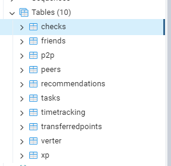
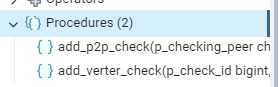
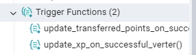
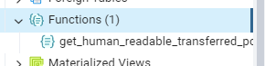
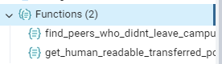
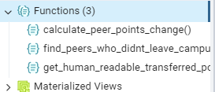
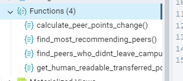
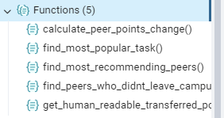
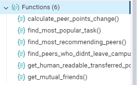

# Info21 v1.0 - Data Analysis and Statistics for School 21

## Tasks

### Task 1: Database Creation
- **`part1.sql`** Script that creates the database and all the tables described 
  in the 
  logical view of the database.

Создание типа перечисления для состояния проверки
```sql
CREATE TYPE check_status AS ENUM ('Start', 'Success', 'Failure');
```
Создание таблицы peers
```sql 
CREATE TABLE IF NOT EXISTS peers (
    nickname VARCHAR(50) PRIMARY KEY,
    birthday DATE NOT NULL
);
```
Создание таблицы tasks
```sql
CREATE TABLE IF NOT EXISTS tasks (
    title VARCHAR(50) PRIMARY KEY,
    parenttask VARCHAR(50),
    maxxp INTEGER NOT NULL CHECK (maxxp > 0)
);
```
Создание таблицы checks
```sql
CREATE TABLE IF NOT EXISTS checks (
    id BIGSERIAL PRIMARY KEY,
    peer VARCHAR(50) NOT NULL REFERENCES peers(nickname) ON DELETE CASCADE,
    task VARCHAR(50) NOT NULL REFERENCES tasks(title) ON DELETE CASCADE,
    "Date" DATE NOT NULL
);
```
Создание таблицы p2p
```sql
CREATE TABLE IF NOT EXISTS p2p (
    id BIGSERIAL PRIMARY KEY,
    "Check" BIGINT NOT NULL REFERENCES checks(id) ON DELETE CASCADE,
    checkingpeer VARCHAR(50) NOT NULL REFERENCES peers(nickname) ON DELETE CASCADE,
    state check_status NOT NULL,
    "Time" TIME NOT NULL
);
```
Создание таблицы verter
```sql
CREATE TABLE IF NOT EXISTS verter (
    id BIGSERIAL PRIMARY KEY,
    "Check" BIGINT NOT NULL REFERENCES checks(id) ON DELETE CASCADE,
    state check_status NOT NULL,
    "Time" TIME NOT NULL
);
```
Создание таблицы xp
```sql
CREATE TABLE IF NOT EXISTS xp (
    id BIGSERIAL PRIMARY KEY,
    "Check" BIGINT NOT NULL REFERENCES checks(id) ON DELETE CASCADE,
    xpamount INTEGER NOT NULL CHECK (xpamount >= 0)
);
```
Создание таблицы transferredpoints
```sql
CREATE TABLE IF NOT EXISTS transferredpoints (
    id BIGSERIAL PRIMARY KEY,
    checkingpeer VARCHAR(50) NOT NULL REFERENCES peers(nickname) ON DELETE CASCADE,
    checkedpeer VARCHAR(50) NOT NULL REFERENCES peers(nickname) ON DELETE CASCADE,
    pointsamount INTEGER NOT NULL CHECK (pointsamount >= 0)
);
```
Создание таблицы friends
```sql
CREATE TABLE IF NOT EXISTS friends (
    id BIGSERIAL PRIMARY KEY,
    peer1 VARCHAR(50) NOT NULL REFERENCES peers(nickname) ON DELETE CASCADE,
    peer2 VARCHAR(50) NOT NULL REFERENCES peers(nickname) ON DELETE CASCADE
);
```
Создание таблицы recommendations
```sql
CREATE TABLE IF NOT EXISTS recommendations (
    id BIGSERIAL PRIMARY KEY,
    peer VARCHAR(50) NOT NULL REFERENCES peers(nickname) ON DELETE CASCADE,
    recommendedpeer VARCHAR(50) NOT NULL REFERENCES peers(nickname) ON DELETE CASCADE
);
```
Создание таблицы timetracking
```sql
CREATE TABLE IF NOT EXISTS timetracking (
    id BIGSERIAL PRIMARY KEY,
    peer VARCHAR(50) NOT NULL REFERENCES peers(nickname) ON DELETE CASCADE,
    "Date" DATE NOT NULL,
    "Time" TIME NOT NULL,
    state INTEGER NOT NULL CHECK (state IN (1, 2)) -- 1 - вход, 2 - выход
);
```
Добавление уникальных ограничений для таблиц friends и recommendations, чтобы избежать дубликатов
```sql
ALTER TABLE friends ADD CONSTRAINT unique_friendship UNIQUE (peer1, peer2);
ALTER TABLE recommendations ADD CONSTRAINT unique_recommendation UNIQUE (peer, recommendedpeer);
```
Добавление индексов для ускорения поиска по часто используемым полям
```sql
CREATE INDEX idx_checks_peer ON checks(peer);
CREATE INDEX idx_checks_task ON checks(task);
CREATE INDEX idx_p2p_check ON p2p("Check");
CREATE INDEX idx_verter_check ON verter("Check");
CREATE INDEX idx_xp_check ON xp("Check");
CREATE INDEX idx_transferredpoints_checkingpeer ON transferredpoints(checkingpeer);
CREATE INDEX idx_transferredpoints_checkedpeer ON transferredpoints(checkedpeer);
CREATE INDEX idx_timetracking_peer_date ON timetracking(peer, "Date");
```


### Task 2: Changing Data
- **`part2.sql`** Script that includes procedures for adding P2P check, 
  adding checking by Verter, and triggers for changing records in the P2P and XP tables.
Изменения данных

Процедура для добавления новой P2P-проверки
```sql
CREATE OR REPLACE PROCEDURE add_p2p_check(
    p_checking_peer VARCHAR,
    p_checked_peer VARCHAR,
    p_task_title VARCHAR,
    p_check_date DATE,
    p_start_time TIME
)
LANGUAGE plpgsql
AS $$
DECLARE
    v_check_id BIGINT;
BEGIN
    -- Проверка существования пиров и задачи
    IF NOT EXISTS (SELECT 1 FROM peers WHERE nickname = p_checking_peer) THEN
        RAISE EXCEPTION 'Пир % не существует.', p_checking_peer;
    END IF;
    IF NOT EXISTS (SELECT 1 FROM peers WHERE nickname = p_checked_peer) THEN
        RAISE EXCEPTION 'Пир % не существует.', p_checked_peer;
    END IF;
    IF NOT EXISTS (SELECT 1 FROM tasks WHERE title = p_task_title) THEN
        RAISE EXCEPTION 'Задача % не существует.', p_task_title;
    END IF;

    -- Вставка записи в таблицу checks
    INSERT INTO checks (peer, task, "Date")
    VALUES (p_checked_peer, p_task_title, p_check_date)
    RETURNING id INTO v_check_id;

    -- Вставка первой записи в таблицу p2p
    INSERT INTO p2p ("Check", checkingpeer, state, "Time")
    VALUES (v_check_id, p_checking_peer, 'Start', p_start_time);

    INSERT INTO transferredpoints (checkingpeer, checkedpeer, pointsamount)
    VALUES (p_checking_peer, p_checked_peer, 0)
    ON CONFLICT DO NOTHING; 

    RAISE NOTICE 'P2P-проверка добавлена. ID проверки: %', v_check_id;
END;
$$;
```
Процедура для добавления проверки Verter
```sql
CREATE OR REPLACE PROCEDURE add_verter_check(
    p_check_id BIGINT,
    p_state check_status,
    p_time TIME
)
LANGUAGE plpgsql
AS $$
BEGIN
    IF NOT EXISTS (SELECT 1 FROM checks WHERE id = p_check_id) THEN
        RAISE EXCEPTION 'Проверка с ID % не существует.', p_check_id;
    END IF;

    IF NOT EXISTS (SELECT 1 FROM p2p WHERE "Check" = p_check_id AND state = 'Success') THEN
        RAISE EXCEPTION 'Проверка с ID % не имеет успешного результата P2P.', p_check_id;
    END IF;

    INSERT INTO verter ("Check", state, "Time")
    VALUES (p_check_id, p_state, p_time);

    RAISE NOTICE 'Проверка Verter добавлена для проверки ID: %', p_check_id;
END;
$$;
```
Обновления таблицы XP
```sql
CREATE OR REPLACE FUNCTION update_xp_on_successful_verter()
RETURNS TRIGGER
LANGUAGE plpgsql
AS $$
DECLARE
    v_maxxp INTEGER;
    v_task_title VARCHAR;
BEGIN
    -- Получаем название задачи по ID проверки
    SELECT c.task INTO v_task_title
    FROM checks c
    WHERE c.id = NEW."Check";

    -- Получаем максимальное количество XP за эту задачу
    SELECT t.maxxp INTO v_maxxp
    FROM tasks t
    WHERE t.title = v_task_title;

    -- Вставляем запись в таблицу xp
    INSERT INTO xp ("Check", xpamount)
    VALUES (NEW."Check", v_maxxp);

    RETURN NEW;
END;
$$;
```


Создание триггера для Вертера!
```sql
CREATE TRIGGER trg_update_xp_after_successful_verter
AFTER INSERT ON verter
FOR EACH ROW
WHEN (NEW.state = 'Success')
EXECUTE FUNCTION update_xp_on_successful_verter();

CREATE OR REPLACE FUNCTION update_transferred_points_on_successful_p2p()
RETURNS TRIGGER
LANGUAGE plpgsql
AS $$
BEGIN
    -- Обновляем количество баллов в таблице transferredpoints
    UPDATE transferredpoints
    SET pointsamount = pointsamount + 1
    WHERE checkingpeer = NEW.checkingpeer
      AND checkedpeer = (SELECT peer FROM checks WHERE id = NEW."Check");

    RETURN NEW;
END;
$$;
```
Создание триггера для p2p
```sql
CREATE TRIGGER trg_update_transferred_points_after_successful_p2p
AFTER INSERT ON p2p
FOR EACH ROW
WHEN (NEW.state = 'Success')
EXECUTE FUNCTION update_transferred_points_on_successful_p2p();
```


### Task 3: Getting Data
- **`part3.sql`** Script that includes functions for returning the 
  TransferredPoints table in a more human-readable form, returning a table of the form: username, name of the checked task, number of XP received, finding the peers who have not left campus for the whole day, calculating the change in the number of peer points of each peer using the TransferredPoints table, and more.

Функция 1: Возвращает таблицу TransferredPoints в более удобочитаемом виде
Возвращает: username (проверяющий), checked_task (название задачи), xp_received (количество XP)
```sql
CREATE OR REPLACE FUNCTION get_human_readable_transferred_points()
RETURNS TABLE (
    username VARCHAR,
    checked_task VARCHAR,
    xp_received INTEGER
)
LANGUAGE sql
AS $$
SELECT
    tp.checkingpeer AS username,
    c.task AS checked_task,
    COALESCE(x.xpamount, 0) AS xp_received
FROM transferredpoints tp
JOIN checks c ON c.peer = tp.checkedpeer
LEFT JOIN xp x ON x."Check" = c.id
ORDER BY username, checked_task;
$$;
```


Функция 2: Находит пиров, которые не покидали кампус весь день
Принимает дату как параметр
``` sql
CREATE OR REPLACE FUNCTION find_peers_who_didnt_leave_campus(p_date DATE)
RETURNS TABLE (
    peer_nickname VARCHAR
)
LANGUAGE sql
AS $$
SELECT DISTINCT tt.peer
FROM timetracking tt
WHERE tt."Date" = p_date
  AND tt.state = 1 -- Вход
  AND NOT EXISTS (
      SELECT 1
      FROM timetracking tt2
      WHERE tt2.peer = tt.peer
        AND tt2."Date" = p_date
        AND tt2.state = 2 -- Выход
  );
$$;
```


Функция 3: Рассчитывает изменение количества очков пиров
Возвращает: peer_nickname, total_points_change
```sql
CREATE OR REPLACE FUNCTION calculate_peer_points_change()
RETURNS TABLE (
    peer_nickname VARCHAR,
    total_points_change INTEGER
)
LANGUAGE sql
AS $$
SELECT
    p.nickname AS peer_nickname,
    COALESCE(SUM(tp.pointsamount), 0)::INTEGER AS total_points_change
FROM peers p
LEFT JOIN transferredpoints tp ON p.nickname = tp.checkedpeer
GROUP BY p.nickname
ORDER BY total_points_change DESC;
$$;
```


Функция 4: Находит пиров, которые рекомендовали больше всего других пиров
```sql
CREATE OR REPLACE FUNCTION find_most_recommending_peers()
RETURNS TABLE (
    peer_nickname VARCHAR,
    recommendations_count INTEGER
)
LANGUAGE sql
AS $$
SELECT
    r.peer AS peer_nickname,
    COUNT(*)::INTEGER AS recommendations_count
FROM recommendations r
GROUP BY r.peer
ORDER BY recommendations_count DESC
LIMIT 1;
$$;
```


Функция 5: Находит самую популярную задачу (по количеству проверок)
```sql
CREATE OR REPLACE FUNCTION find_most_popular_task()
RETURNS TABLE (
    task_title VARCHAR,
    checks_count INTEGER
)
LANGUAGE sql
AS $$
SELECT
    c.task AS task_title,
    COUNT(*)::INTEGER AS checks_count
FROM checks c
GROUP BY c.task
ORDER BY checks_count DESC
LIMIT 1;
$$;
```


Функция 6: Возвращает список всех пиров, которые являются друзьями
```sql
CREATE OR REPLACE FUNCTION get_mutual_friends()
RETURNS TABLE (
    peer1 VARCHAR,
    peer2 VARCHAR
)
LANGUAGE sql
AS $$
SELECT
    f1.peer1,
    f1.peer2
FROM friends f1
WHERE EXISTS (
    SELECT 1
    FROM friends f2
    WHERE f2.peer1 = f1.peer2 AND f2.peer2 = f1.peer1
)
ORDER BY f1.peer1, f1.peer2;
$$;
```
