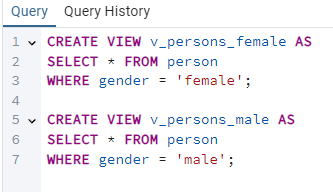
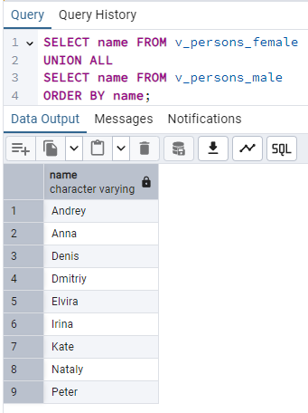
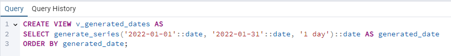
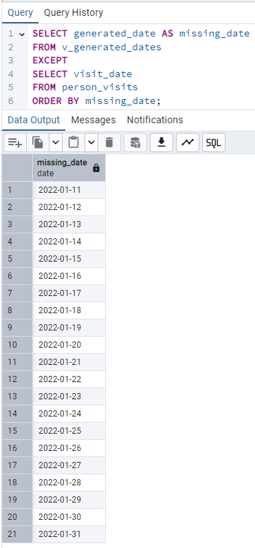
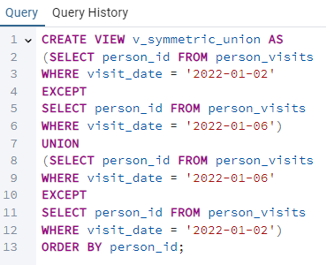
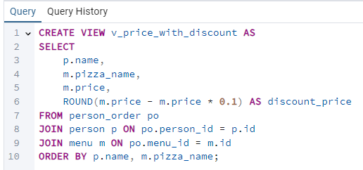
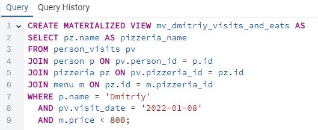
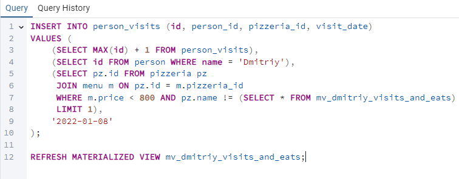
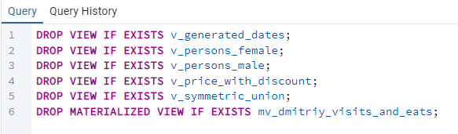

## Day 04 - Piscine SQL

#### Exercise 00 - Let’s create separated views for persons
Please create 2 Database Views (with similar attributes like the original table) based on simple filtering of gender of persons. Set the corresponding names for the database views: `v_persons_female` and `v_persons_male`.
``` sql
CREATE VIEW v_persons_female AS
SELECT * FROM person
WHERE gender = 'female';

CREATE VIEW v_persons_male AS
SELECT * FROM person
WHERE gender = 'male';
```


#### Exercise 01 - From parts to common view
Please use 2 Database Views from Exercise #00 and write SQL to get female and male person names in one list. Please set the order by person name. The sample of data is presented below.
```sql
SELECT name FROM v_persons_female
UNION ALL
SELECT name FROM v_persons_male
ORDER BY name;
```


#### Exercise 02 - “Store” generated dates in one place
Please create a Database View (with name `v_generated_dates`) which should be “store” generated dates from 1st to 31th of January 2022 in DATE type. Don’t forget about order for the generated_date column.  
```sql 
CREATE VIEW v_generated_dates AS
SELECT generate_series('2022-01-01'::date, '2022-01-31'::date, '1 day')::date AS generated_date
ORDER BY generated_date;
```


#### Exercise 03 - Find missing visit days with Database View
Please write a SQL statement which returns missing days for persons’ visits in January of 2022. Use `v_generated_dates` view for that task and sort the result by missing_date column. The sample of data is presented below.
```sql
SELECT generated_date AS missing_date
FROM v_generated_dates
EXCEPT
SELECT visit_date
FROM person_visits
ORDER BY missing_date;
```


#### Exercise 04 - Let’s find something from Set Theory
Please write a SQL statement which satisfies a formula `(R - S)∪(S - R)` .
Where R is the `person_visits` table with filter by 2nd of January 2022, S is also `person_visits` table but with a different filter by 6th of January 2022. Please make your calculations with sets under the `person_id` column and this column will be alone in a result. The result please sort by `person_id` column and your final SQL please present in `v_symmetric_union` (*) database view.
```sql
CREATE VIEW v_symmetric_union AS
(SELECT person_id FROM person_visits
WHERE visit_date = '2022-01-02'
EXCEPT
SELECT person_id FROM person_visits
WHERE visit_date = '2022-01-06')
UNION
(SELECT person_id FROM person_visits
WHERE visit_date = '2022-01-06'
EXCEPT
SELECT person_id FROM person_visits
WHERE visit_date = '2022-01-02')
ORDER BY person_id;
```


#### Exercise 05 - Let’s calculate a discount price for each person
Please create a Database View `v_price_with_discount` that returns a person's orders with person names, pizza names, real price and calculated column `discount_price` (with applied 10% discount and satisfies formula `price - price*0.1`). The result please sort by person name and pizza name and make a round for `discount_price` column to integer type. Please take a look at a sample result below.
```sql
CREATE VIEW v_price_with_discount AS
SELECT 
    p.name,
    m.pizza_name,
    m.price,
    ROUND(m.price - m.price * 0.1) AS discount_price
FROM person_order po
JOIN person p ON po.person_id = p.id
JOIN menu m ON po.menu_id = m.id
ORDER BY p.name, m.pizza_name;
```


#### Exercise 06 - Materialization from virtualization
Please create a Materialized View `mv_dmitriy_visits_and_eats` (with data included) based on SQL statement that finds the name of pizzeria Dmitriy visited on January 8, 2022 and could eat pizzas for less than 800 rubles (this SQL you can find out at Day #02 Exercise #07). 
```sql
CREATE MATERIALIZED VIEW mv_dmitriy_visits_and_eats AS
SELECT pz.name AS pizzeria_name
FROM person_visits pv
JOIN person p ON pv.person_id = p.id
JOIN pizzeria pz ON pv.pizzeria_id = pz.id
JOIN menu m ON pz.id = m.pizzeria_id
WHERE p.name = 'Dmitriy' 
  AND pv.visit_date = '2022-01-08'
  AND m.price < 800;
```


#### Exercise 07 - Refresh our state
Let's refresh data in our Materialized View `mv_dmitriy_visits_and_eats` from exercise #06. Before this action, please generate one more Dmitriy visit that satisfies the SQL clause of Materialized View except pizzeria that we can see in a result from exercise #06.
After adding a new visit please refresh a state of data for `mv_dmitriy_visits_and_eats`.
```sql
INSERT INTO person_visits (id, person_id, pizzeria_id, visit_date)
VALUES (
    (SELECT MAX(id) + 1 FROM person_visits),
    (SELECT id FROM person WHERE name = 'Dmitriy'),
    (SELECT pz.id FROM pizzeria pz
     JOIN menu m ON pz.id = m.pizzeria_id
     WHERE m.price < 800 AND pz.name != (SELECT * FROM mv_dmitriy_visits_and_eats)
     LIMIT 1),
    '2022-01-08'
);

REFRESH MATERIALIZED VIEW mv_dmitriy_visits_and_eats;
```


#### Exercise 08 - Just clear our database
After all our exercises were born a few Virtual Tables and one Materialized View. Let’s drop them!
```sql
DROP VIEW IF EXISTS v_generated_dates;
DROP VIEW IF EXISTS v_persons_female;
DROP VIEW IF EXISTS v_persons_male;
DROP VIEW IF EXISTS v_price_with_discount;
DROP VIEW IF EXISTS v_symmetric_union;
DROP MATERIALIZED VIEW IF EXISTS mv_dmitriy_visits_and_eats;
```

