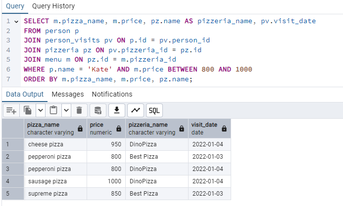
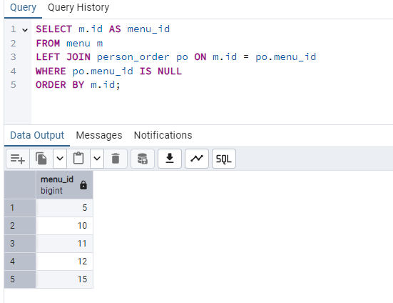
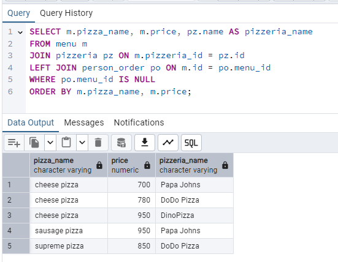
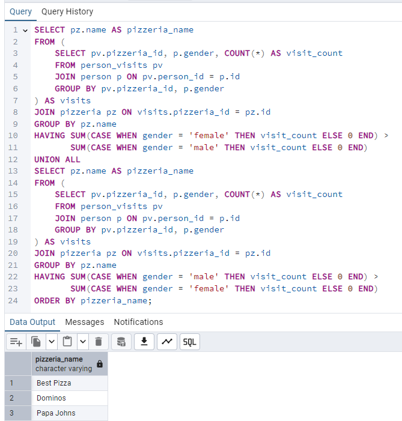
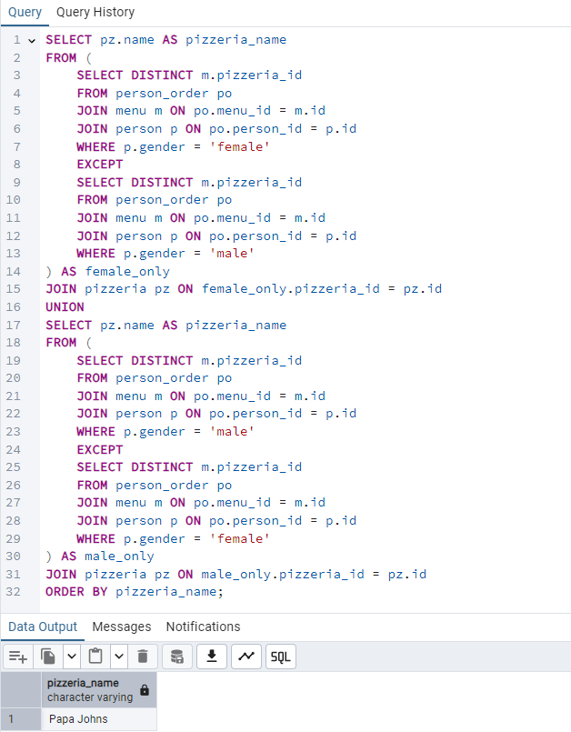
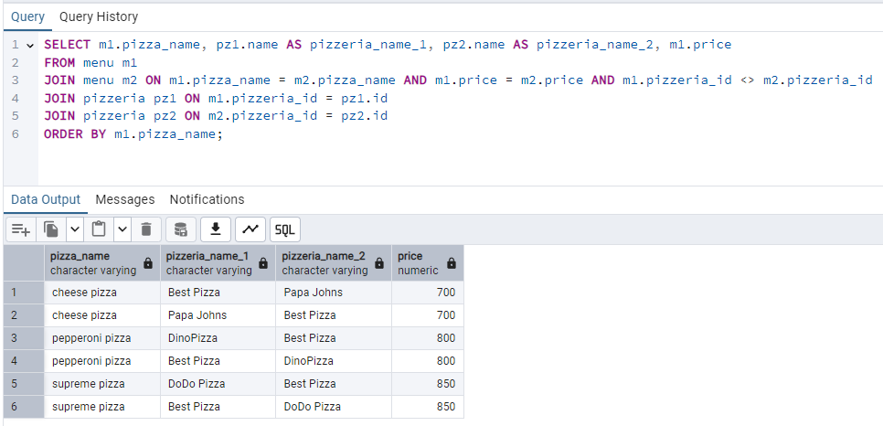
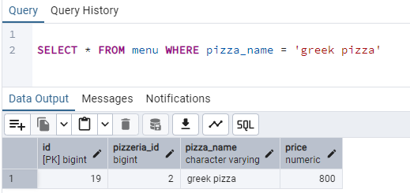
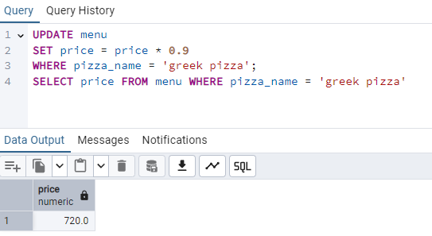
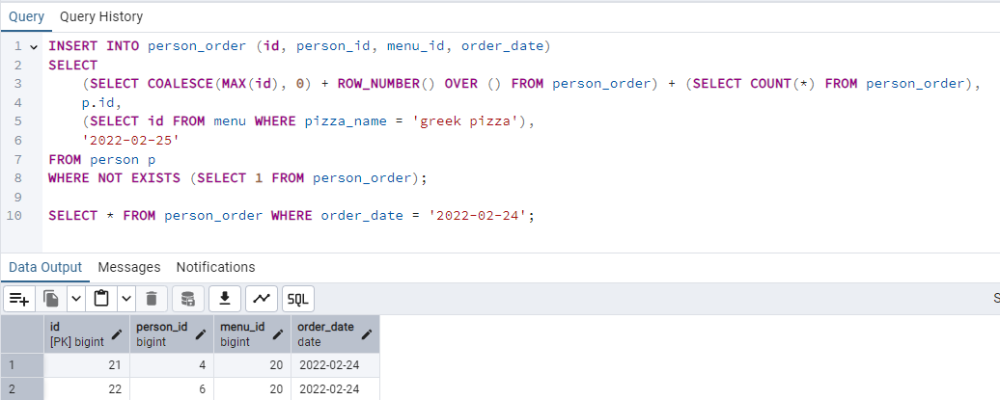
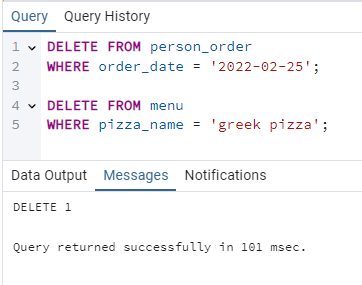

## Day 03 - Piscine SQL

#### Exercise 00 - Let’s find appropriate prices for Kate
Please write a SQL statement which returns a list of pizza names, pizza prices, pizzerias names and dates of visit for Kate and for prices in range from 800 to 1000 rubles. Please sort by pizza, price and pizzeria names. Take a look at the sample of data below.
``` sql
SELECT m.pizza_name, m.price, pz.name AS pizzeria_name, pv.visit_date
FROM person p
JOIN person_visits pv ON p.id = pv.person_id
JOIN pizzeria pz ON pv.pizzeria_id = pz.id
JOIN menu m ON pz.id = m.pizzeria_id
WHERE p.name = 'Kate' AND m.price BETWEEN 800 AND 1000
ORDER BY m.pizza_name, m.price, pz.name;
```


#### Exercise 01 - Let’s find forgotten menus
Please find all menu identifiers which are not ordered by anyone. The result should be sorted by identifiers. The sample of output data is presented below.
``` sql
SELECT m.id AS menu_id
FROM menu m
LEFT JOIN person_order po ON m.id = po.menu_id
WHERE po.menu_id IS NULL
ORDER BY m.id;
```


#### Exercise 02 - Let’s find forgotten pizza and pizzerias
Please use SQL statement from Exercise #01 and show pizza names from pizzeria which are not ordered by anyone, including corresponding prices also. The result should be sorted by pizza name and price. The sample of output data is presented below.
``` sql
SELECT m.pizza_name, m.price, pz.name AS pizzeria_name
FROM menu m
JOIN pizzeria pz ON m.pizzeria_id = pz.id
LEFT JOIN person_order po ON m.id = po.menu_id
WHERE po.menu_id IS NULL
ORDER BY m.pizza_name, m.price;
```


#### Exercise 03 - Let’s compare visits
Please find pizzerias that have been visited more often by women or by men. For any SQL operators with sets save duplicates (UNION ALL, EXCEPT ALL, INTERSECT ALL constructions). Please sort a result by the pizzeria name. The data sample is provided below.
``` sql
SELECT pz.name AS pizzeria_name
FROM (
    SELECT pv.pizzeria_id, p.gender, COUNT(*) AS visit_count
    FROM person_visits pv
    JOIN person p ON pv.person_id = p.id
    GROUP BY pv.pizzeria_id, p.gender
) AS visits
JOIN pizzeria pz ON visits.pizzeria_id = pz.id
GROUP BY pz.name
HAVING SUM(CASE WHEN gender = 'female' THEN visit_count ELSE 0 END) > 
       SUM(CASE WHEN gender = 'male' THEN visit_count ELSE 0 END)
UNION ALL
SELECT pz.name AS pizzeria_name
FROM (
    SELECT pv.pizzeria_id, p.gender, COUNT(*) AS visit_count
    FROM person_visits pv
    JOIN person p ON pv.person_id = p.id
    GROUP BY pv.pizzeria_id, p.gender
) AS visits
JOIN pizzeria pz ON visits.pizzeria_id = pz.id
GROUP BY pz.name
HAVING SUM(CASE WHEN gender = 'male' THEN visit_count ELSE 0 END) > 
       SUM(CASE WHEN gender = 'female' THEN visit_count ELSE 0 END)
ORDER BY pizzeria_name;
```


#### Exercise 04 - Let’s compare orders
Please find a union of pizzerias that have orders either from women or  from men. Other words, you should find a set of pizzerias names have been ordered by females only and make "UNION" operation with set of pizzerias names have been ordered by males only. Please be aware with word “only” for both genders. For any SQL operators with sets don’t save duplicates (`UNION`, `EXCEPT`, `INTERSECT`).  Please sort a result by the pizzeria name. The data sample is provided below.
```sql
SELECT pz.name AS pizzeria_name
FROM (
    SELECT DISTINCT m.pizzeria_id
    FROM person_order po
    JOIN menu m ON po.menu_id = m.id
    JOIN person p ON po.person_id = p.id
    WHERE p.gender = 'female'
    EXCEPT
    SELECT DISTINCT m.pizzeria_id
    FROM person_order po
    JOIN menu m ON po.menu_id = m.id
    JOIN person p ON po.person_id = p.id
    WHERE p.gender = 'male'
) AS female_only
JOIN pizzeria pz ON female_only.pizzeria_id = pz.id
UNION
SELECT pz.name AS pizzeria_name
FROM (
    SELECT DISTINCT m.pizzeria_id
    FROM person_order po
    JOIN menu m ON po.menu_id = m.id
    JOIN person p ON po.person_id = p.id
    WHERE p.gender = 'male'
    EXCEPT
    SELECT DISTINCT m.pizzeria_id
    FROM person_order po
    JOIN menu m ON po.menu_id = m.id
    JOIN person p ON po.person_id = p.id
    WHERE p.gender = 'female'
) AS male_only
JOIN pizzeria pz ON male_only.pizzeria_id = pz.id
ORDER BY pizzeria_name;
```


#### Exercise 05 - Visited but did not make any order
Please write a SQL statement which returns a list of pizzerias which Andrey visited but did not make any orders. Please order by the pizzeria name. The sample of data is provided below.
``` sql
SELECT pz.name AS pizzeria_name
FROM person_visits pv
JOIN pizzeria pz ON pv.pizzeria_id = pz.id
JOIN person p ON pv.person_id = p.id
LEFT JOIN person_order po ON pv.person_id = po.person_id AND pv.pizzeria_id = (SELECT m.pizzeria_id FROM menu m WHERE m.id = po.menu_id)
WHERE p.name = 'Andrey' AND po.id IS NULL
ORDER BY pz.name;
```


#### Exercise 06 - Find price-similarity pizzas
Please find the same pizza names who have the same price, but from different pizzerias. Make sure that the result is ordered by pizza name. The sample of data is presented below. Please make sure your column names are corresponding column names below.
``` sql
SELECT m1.pizza_name, pz1.name AS pizzeria_name_1, pz2.name AS pizzeria_name_2, m1.price
FROM menu m1
JOIN menu m2 ON m1.pizza_name = m2.pizza_name AND m1.price = m2.price AND m1.pizzeria_id <> m2.pizzeria_id
JOIN pizzeria pz1 ON m1.pizzeria_id = pz1.id
JOIN pizzeria pz2 ON m2.pizzeria_id = pz2.id
ORDER BY m1.pizza_name;
```


#### Exercise 07 - Let’s cook a new type of pizza
Please register a new pizza with name “greek pizza” (use id = 19) with price 800 rubles in “Dominos” restaurant (pizzeria_id = 2).
**Warning**: this exercise will probably be the cause  of changing data in the wrong way. Actually, you can restore the initial database model with data from the link in the “Rules of the day” section.
```sql
INSERT INTO menu (id, pizzeria_id, pizza_name, price)
VALUES (19, 2, 'greek pizza', 800);
```



#### Exercise 08 - Let’s cook a new type of pizza with more dynamics
Please register a new pizza with name “sicilian pizza” (whose id should be calculated by formula is “maximum id value + 1”) with a price of 900 rubles in “Dominos” restaurant (please use internal query to get identifier of pizzeria).
**Warning**: this exercise will probably be the cause  of changing data in the wrong way. Actually, you can restore the initial database model with data from the link in the “Rules of the day” section and replay script from Exercise 07.
``` sql
INSERT INTO menu (id, pizzeria_id, pizza_name, price)
VALUES ((SELECT MAX(id) + 1 FROM menu), (SELECT id FROM pizzeria WHERE name = 'Dominos'), 'sicilian pizza', 900);
```


#### Exercise 09 - New pizza means new visits
Please register new visits into Dominos restaurant from Denis and Irina on 24th of February 2022.
**Warning**: this exercise will probably be the cause  of changing data in the wrong way. Actually, you can restore the initial database model with data from the link in the “Rules of the day” section and replay script from Exercises 07 and 08..
```sql
INSERT INTO person_visits (id, person_id, pizzeria_id, visit_date)
VALUES 
((SELECT MAX(id) + 1 FROM person_visits), (SELECT id FROM person WHERE name = 'Denis'), (SELECT id FROM pizzeria WHERE name = 'Dominos'), '2022-02-24'),
((SELECT MAX(id) + 2 FROM person_visits), (SELECT id FROM person WHERE name = 'Irina'), (SELECT id FROM pizzeria WHERE name = 'Dominos'), '2022-02-24');
```


#### Exercise 10 - New visits means new orders
Please register new orders from Denis and Irina on 24th of February 2022 for the new menu with “sicilian pizza”.
**Warning**: this exercise will probably be the cause  of changing data in the wrong way. Actually, you can restore the initial database model with data from the link in the “Rules of the day” section and replay script from Exercises 07 , 08 and 09.
```sql
INSERT INTO person_order (id, person_id, menu_id, order_date)
VALUES 
((SELECT MAX(id) + 1 FROM person_order), (SELECT id FROM person WHERE name = 'Denis'), (SELECT id FROM menu WHERE pizza_name = 'sicilian pizza'), '2022-02-24'),
((SELECT MAX(id) + 2 FROM person_order), (SELECT id FROM person WHERE name = 'Irina'), (SELECT id FROM menu WHERE pizza_name = 'sicilian pizza'), '2022-02-24');
```


#### Exercise 11 - “Improve” a price for clients
Please change the price for “greek pizza” on -10% from the current value.
**Warning**: this exercise will probably be the cause  of changing data in the wrong way. Actually, you can restore the initial database model with data from the link in the “Rules of the day” section and replay script from Exercises 07 , 08 ,09 and 10.
```sql
UPDATE menu
SET price = price * 0.9
WHERE pizza_name = 'greek pizza';
```


#### Exercise 12 - New orders are coming!
Please register new orders from all persons for “greek pizza” on 25th of February 2022.
**Warning**: this exercise will probably be the cause  of changing data in the wrong way. Actually, you can restore the initial database model with data from the link in the “Rules of the day” section and replay script from Exercises 07 , 08 ,09 , 10 and 11.
``` sql
INSERT INTO person_order (id, person_id, menu_id, order_date)
SELECT 
    (SELECT COALESCE(MAX(id), 0) + ROW_NUMBER() OVER () FROM person_order) + (SELECT COUNT(*) FROM person_order),  
    p.id,
    (SELECT id FROM menu WHERE pizza_name = 'greek pizza'),
    '2022-02-25'
FROM person p
WHERE NOT EXISTS (SELECT 1 FROM person_order);  

SELECT * FROM person_order WHERE order_date = '2022-02-24';
```


#### Exercise 13 - Money back to our customers
Please write 2 SQL (DML) statements that delete all new orders from exercise #12 based on order date. Then delete “greek pizza” from the menu. 
**Warning**: this exercise will probably be the cause  of changing data in the wrong way. Actually, you can restore the initial database model with data from the link in the “Rules of the day” section and replay script from Exercises 07 , 08 ,09 , 10 , 11, 12 and 13.
```sql
DELETE FROM person_order
WHERE order_date = '2022-02-25';

DELETE FROM menu
WHERE pizza_name = 'greek pizza';
```

